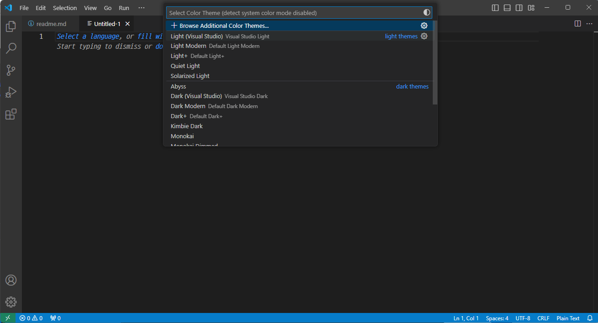
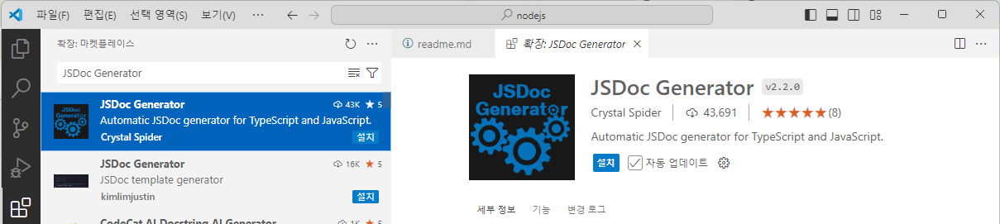
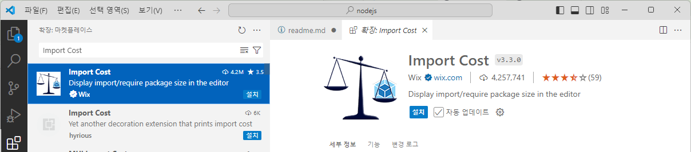
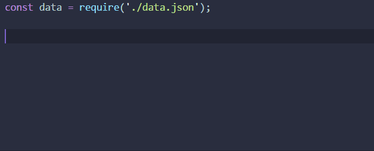
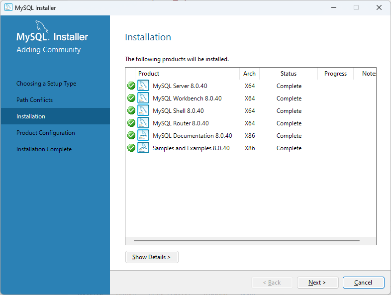
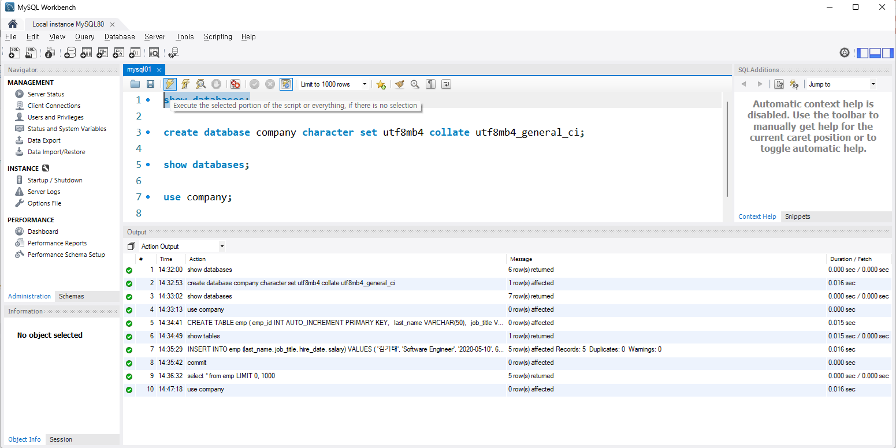

# Chapter 1. Node.js

## 1.1 Node.js의 개념

Node.js는 자바스크립트를 서버 환경에서 실행할 수 있도록 하는 자바스크립트 런타임입니다. 비동기 I/O와 이벤트 기반 아키텍처를 사용해 높은 성능과 확장성을 제공하며, 주로 웹 서버나 네트워크 애플리케이션 개발에 사용됩니다.

<br>

### 1.1.1 Node.js란

Node.js는 Chrome의 V8 자바스크립트 엔진을 기반으로 한 서버 사이드 자바스크립트 런타임입니다. 주로 웹 서버 개발에 사용되며, 비동기 I/O와 이벤트 기반 프로그래밍을 지원하여 높은 성능과 확장성을 제공합니다.

<br>

### 1.1.2 Node.js 동작 방식

(1) **Node.js 동작 방식**
Node.js를 창시한 라이언 달이 노드를 만든 이유로 꼽은 것은, 기존에 많이 사용되고 있는 WAS라고 불리는 Apache, Tomcat 같은 서버들은 오래걸리는 blocking 작업에서 원활한 사용에 문제가 생겨 동시성 프로그래밍을 위해 Node.js를 만들었다고 한다.

(2) **Node를 사용하는 이유**

    ① 처리 속도가 빠릅니다.
    ② 모든 동작이 비동기 기반입니다.
    ③ Event driven 입니다.

위의 내용 처럼 세 가지가 있습니다.
처리 속도가 빠른 이유는 Node의 동작 방식에서 찾아볼 수 있습니다.

(3) **Event Loop**
메인 스레드 겸 싱글 스레드로서 비즈니스 로직을 수행한다. 모든 작업이 이벤트 루프를 중심으로 일어나기 때문에 이벤트 루프가 멈추면 아무 작업도 수행하지 못한다.

Node.js 는Event Loop 중심으로 동작한다. 구글에서 여러 구조 사진을 볼 수 있지만 대부분의 사진이 틀린 정보라고 합니다.


이런 구조가 굉장히 보편적이었는데, 이 구조는 틀린 구조라고 합니다.


이 구조가 더 Node.js 개발자가 밝힌 내용과 부합한 내용이라고 합니다.

싱글스레드 방식을 사용함에도 여러가지 작업을 동시에 처리할 수 있는 이유가 이벤트 루프에있다.

loupe
자바스크립트 동작 과정을 눈으로 볼 수 있는 사이트입니다. 
위 동영상 강연자분이 실제로 사용했던 사이트라고 합니다.

1. 이벤트루프가 왜 중요한가?
이벤트루프는 메인스레드 겸 싱글스레드로서, 비즈니스 로직을 수행한다. 수행도중에 블로킹 IO작업을 만나면 커널 비동기 또는 자신의 워커쓰레드풀에게 넘겨주는 역할까지 한다. 보통 웹어플리케이션에서 쓰니, 웹으로 예를 들자면 request 가 들어오면 라우터태우기, if문분기, 반복문돌며 필터링, 콜백내부로직 등은 이벤트루프가 수행하지만 DB에서 데이터를 읽어오거나(DB드라이버 개발자가 물론 비동기타게 짜야..) 외부 API콜을 하는 것은 커널 비동기 또는 자신의 워커쓰레드가 수행한다. 동시에 많은 요청이 들어온다해도 1개의 이벤트루프에서 처리한다. 따라서 JS로직(if분기, 반복문 등)이 무겁다면 많은 요청을 처리해내기 힘들 것이다. (실제로는 여러개 node인스턴스들이 떠서 상관없지만, 여기선 1개의 node인스턴스로 생각) 따라서 이벤트루프가 블로킹되는 것은 만병의 근원이다. 예를들어 while(true) {} 가 중간에 있으면 nodejs웹서버는 요청조차 받지 못한다. 또한 GC조차 이벤트루프에서 돌고 있으니, 이벤트루프가 바쁘면(= cpu인텐시브 작업) 메모리가 부족해서 뻗을 것이다.

<br>

2. libuv는 어떻게 동작하는가?
libuv는 윈도우 커널, 리눅스 커널을 추상화해서 wrapping하고 있습니다. nodejs는 기본적으로 libuv 위에서 동작하며, node 인스턴스가 뜰 때, libuv에는 워커 쓰레드풀(default 4개)이 생성된다. 위에서 블로킹 작업(api콜, DB Read/Write 등)들이 들어오면 이벤트루프가 uv_io에게 내려준다고 하였다. libuv는 커널단(윈도우의 경우 IOCP, 리눅스는 AIO)에서 어떤 비동기 작업들을 지원해주는지 알고 있기때문에, 그런 종류의 작업들을 받으면, 커널의 비동기함수들을 호출한다. 작업이 완료되면 시스템콜을 libuv에게 던져준다. libuv 내에 있는 이벤트루프에게 콜백으로서 등록됩니다.libuv의 워커쓰레드는 커널이 지원안하는 작업들을 수행합니다. 대표적인 예로 소켓 작업류는 커널들이 이미 비동기로 지원하지만, 파일시스템쪽 작업은 지원하지 않는데(정확히는 지원하지만 libuv에서 추상화 문제로 쓰지 않는다고 합니다) 이럴때 libuv의 쓰레드가 쓰입니다.


<br>

3. 이벤트루프의 내부 동작과정
3-1. 이벤트루프의 phase들이벤트루프는 몇 개의 phase 들로 구성되어 있습니다. 각 phase 들은 FIFO 큐를 가지고 있으며, 이 큐에는 특정 이벤트의 콜백들을 넣고, CPU가 할당(=이벤트루프가 해당 phase를 호출할때)될 때 실행합니다. 아래는 phase들입니다.

**timers**
    setTimeout()과 setInterval() 과 같은 타이머 콜백들이 처리된다.
    코드를 보면 이벤트루프가 uv__run_timers() 호출할때 타이머 콜백들을 받고, 실제 유저로직은 timer_cb인데, 이걸 poll 큐에 등록해버린다.
    따라서 타이머 콜백 내부로직들은 poll큐에 먼저 등록된 콜백들이 처리되고 나중에 처리될 수도 있으므로, 파라미터로 지정한 시간에 딱 실행됨을 보장하지 못한다. 즉, 파라미터는 일정 시간 이후에 실행된다는 기준 시간같은 셈이다.
    ex. setTimeout(?, 100) 은 100ms 이후 언제 실행될지 모름. (poll 큐가 비어있다면 100ms 후 딱 실행되겠지만..)

**I/O callbacks**
    클로즈 콜백, 타이머로 스케줄링된 콜백, setImmediate()를 제외한 거의 모든 콜백들을 집행
    http, apiCall, DB read 등..
    이것 역시 작업완료는 이벤트루프가 I/O callbacks 영역을 호출(uv__run_pending())할 때 체크할 수 있지만, 이후에 콜백이 poll 큐에 등록되므로, 이벤트루프가 poll 영역을 처리할때 콜백 내부로직이 실행된다.

idle, prepare: 내부용으로만 사용 (모든 큐가 비어있으면 idle이 되면서 tick frequency가 떨어짐=할일도없으니 이벤트루프가 천천히 돈다고 한다.. 확인안해봄)

**poll**
    이벤트루프가 uv__io_poll() 를 호출했을때 poll 큐에 있는 이벤트, 콜백들을 처리
    만약 cpu를 할당받았을 때
        poll 큐가 비어있음 : setImmediate()가 있으면 check로 넘어감. 없으면 이벤트루프가 phase를 돌며 콜백을 무한히 기다림 => 공식문서에 이렇게 써있는데 코드를 보면 당연한 이야기다. poll 이 끝나면 uv__run_check()가 호출된다.
        poll 큐에 뭐가있음 : 이벤트루프가 큐를 순회하며 처리함.
**check** 
    setImmediate() 콜백은 여기서 호출되고 집행
**close callbacks**
    .on('close', ...) 같은 것들이 여기서 처리됨
 
**예제1**

```javascript
fs.readFile(__filename, () => {
    setTimeout(() => {
        console.log('A');
    }, 0);
    setImmediate(() => {
        console.log('B');
    });
});
```

위 코드를 실행하면 이벤트루프에서는 아래와 같은 순서로 동작합니다.
   1. fs.readFile 라는 블로킹작업을 만난 시점에 이벤트루프는 워커쓰레드에게 작업을 넘김
   2. 워크쓰레드가 작업을 완료한 뒤 I/O callbacks 영역의 큐에 콜백을 등록
   3. 이벤트루프가 I/O callbacks 영역을 실행할 때, 콜백을 poll 영역의 큐에 등록
   4. 이벤트루프가 poll 영역을 실행할 때, 큐에 1개가 있으므로 이걸 실행함.
   5. (콜백내부) 2라인에서 setTimeout() 이므로 다시 timers 영역에 넣고 5라인으로 간다.
   6. (콜백내부) 5라인에서 setImmediate() 이므로 check 영역에 넣는다.
   7. 이벤트루프가 poll 큐를 비우고, 다음 실행영역인 check 영역으로 간다. check 영역의 큐에는 들어있는 'B'를 콘솔에 찍는다. check 영역의 큐를 비우고 다시 while문의 시작지점으로 간다.
   8. 이벤트루프가 timers 영역을 호출한다. uv__run_timers()는 setTimeout()의 콜백을 poll큐에 등록한다.
   9. 이벤트루프가 2번째로 poll 영역을 실행한다. 큐에 1개가 있으므로 이걸 실행하고 'A'를 찍는다.
   10. node 프로세스가 반환되고 끝

**예제2**

```javascript
setTimeout(() => {
    console.log('A');
}, 0);
setImmediate(() => {
    console.log('B');
});
```

위 코드를 실행하면 이벤트루프에서는 아래와 같은 순서로 동작합니다.
    1. setTimeout() 를 만나면 timers 영역에 넣고 4라인으로 갑니다.
    2. setImmediate() 를 만나면 check 영역에 넣습니다.
    3. 프로세스의 기분과 상태 등에 따라 랜덤하지만, timers 가 이벤트루프의 은총을 받으면 먼저 poll 큐에 등록되고 timers 다음은 poll 이니까 'A'가 찍힐 것입니다. 하지만 timers 를 지나쳤을 경우, check 영역이 호출되므로 'B' 가 찍힙니다.

<br>

```javascript
while (r != 0 && loop->stop_flag == 0) {
      uv__update_time(loop); // loop time 갱신
      uv__run_timers(loop); // timers 이벤트 처리
      ran_pending = uv__run_pending(loop); // IO callbacks 이벤트큐 처리
      uv__run_idle(loop);
      uv__run_prepare(loop);

      timeout = 0;
      if ((mode == UV_RUN_ONCE && !ran_pending) || mode == UV_RUN_DEFAULT)
          timeout = uv_backend_timeout(loop);

      uv__io_poll(loop, timeout); // poll 이벤트큐 처리
      uv__run_check(loop); // check 이벤트큐 처리
      uv__run_closing_handles(loop); // close 이벤트큐 처리

      r = uv__loop_alive(loop); // 이벤트루프 상태체크
      if (mode == UV_RUN_ONCE || mode == UV_RUN_NOWAIT)
          break;
  }
```

- 대표적으로 몇가지 phase들을 확인해보면 uv__run_pending() 는 자신의 QUEUE* q 를 가지고 있고, 이벤트루프에서 호출했을때 while (!QUEUE_EMPTY(&pq)) 로 처리한다. 처리가 끝난 건 w->cb(loop, w, POLLOUT); 콜백으로 넘겨줌
- uv__io_poll() 도 마찬가지로 자신의 QUEUE* q; 를 가지고 있었고, while (!QUEUE_EMPTY(&loop->watcher_queue)) 로 처리한다.

<br>

(4) **Event driven**
자바스크립트는 이벤트 기반의 동작을 한다.
이벤트 기반의 반대는 일반적인 스레드 풀 기반의 동작이라고 할 수 있는데, 이 구조에서는 사용자의 I/O 요청에서 오래 걸리는 작업이 있을 경우 한 가지 작업이 끝날 때까지 (즉 동기적으로) 대기하며 이것이 완료되면 다음 작업이 순차적으로 진행되는 방식입니다.

반면, 이벤트 기반의 동작 방식이란, 순차적인 이벤트 진행이 아닌 사용자가 이벤트를 실행시켰을 때 이에 대한 callback을 호출하는 방식으로 비동기적으로 동작하는 방식입니다.
이것은 자바스크립트가 원래 나온것이 웹에서 사용되기 위함이었기 때문입니다.


<br><br>

## 1.2 개발환경 설정

(1) Node.js 설치: Node.js 공식 웹사이트에서 운영 체제에 맞는 설치 프로그램을 다운로드하여 설치합니다. 설치 시 npm(Node Package Manager)도 함께 설치됩니다.

(2) 프로젝트 폴더 생성: 터미널이나 명령 프롬프트에서 프로젝트를 저장할 폴더를 만듭니다.

(3) 프로젝트 초기화: 프로젝트 폴더에서 npm init 명령어를 실행하여 package.json 파일을 생성하고, 필요한 정보를 입력합니다.

(4) 필요한 패키지 설치: npm install <패키지 이름> 명령어로 필요한 라이브러리나 모듈을 설치합니다.

(5) 코드 편집기 사용: VS Code와 같은 코드 편집기를 사용하여 코드를 작성하고, 터미널에서 node <파일명> 명령어로 실행합니다.

<br>

### 1.2.1 Node.js 설치 및 설정

(1) Node.js 다운로드

Node.js 다운로드 사이트 바로가기 ☞ [Node.js 다운로드](https://nodejs.org/en/download/prebuilt-installer)


<br>

(2) Node 설치

① 설치 시작
다운로드 디렉토리에서 `node-v18.16-x64.msi` 를 더블클릭하여 설치 화면이 나오면, [Next] 버튼을 누릅니다.


<br>

② 약관 동의 페이지


<br>

③ 설치 위치 지정


<br>

④ 설치할 패키지 또는 부가기능 선택


<br>

⑤ Native Module 을 위한 도구 선택


<br>

⑥ Node 도구 준비 화면


<br>

⑦ Node 설치 완료


<br>

(3) Node 기본 명령

① Command Prompt


<br>

② Node 설치 확인


<br>

(4) Node 자바스크립트 실행

① Hello.js 작성

```javascript
console.log("Hello");
```

위 코드를 메모장에서 작성하고 Hello.js로 저장합니다.

<br>

② Node.js command prompt를 실행하고 아래와 같이 Hello.js를 실행합니다.


```shell
node Hello
```

<br>

### 1.2.2 Visual Studio Code 설치 및 설정

Visual Studio Code는 마이크로소프트 사에서 개발한 코드 편집이 가능한 에디터로서 문서 작업을 할 때 MS-WORD나 아래한글과 같은 워드프로세서를 사용하는 것처럼 코딩을 할 때는 VS Code와 같은 코드 편집 프로그램을 사용합니다.
Visual Studio는 IDE(Intergrated Development Environment)로서 통합 개발 환경으로 개발과 관련된 모든 작업을 수행할 수 있는 공간을 제공하지만, VS Code는 내부적인 환경을 구축하지 않아도 사용이 가능하지만, Visual Studio는 프로그램이 다소 무겁기 때문에 용량이 매우 크고 설치 과정도 복잡합니다.

(1) Visual Studio Code 다운로드

VS Code 다운로드 바로가기 ☞ [VS Code 다운로드](https://code.visualstudio.com/)


<br>

(2) Visual Studio Code 설치

① 설치 시작
윈도우 탐색기에서 다운로드 폴더 안에 있는 다운로드한 설치 파일인 `VSCodeUserSetup-x64-1.94.2.exe` 을 실행합니다.

<br>

② 라이선스 사용권 계약 동의


위와 같은 페이이지가 로딩되면, '동의합니다' 를 선택하고, [Next] 버튼을 누릅니다.

<br>

③ 설치 디렉토리 지정


"Visual Studio Code"를 "Applications" 폴더에 설치하도록 설정합니다.

<br>

④ 시작 메뉴 폴더 선택


[다음] 버튼을 클릭합니다.

<br>

⑤ 추가 작업 선택


원하는 추가 작업을 선택하고, [다음] 버튼을 클릭하여 설치를 진행합니다.

<br>

⑥ 설치 준비 완료


[설치] 버튼을 클릭하여 설치를 진행합니다.


⑦ 설치 완료


설치가 완료 화면이 나오면 [종료] 버튼을 클릭합니다.

<br>

⑧ 설치 완료


설치가 완료 화면이 나오면 [종료] 버튼을 클릭합니다.

<br>

(3) 테마 설정

① 설정 메뉴 선택


위 그림과 같이 좌측 사이드 툴바 맨 아래 톱니바퀴 모양의 `설정 관리자(Manage)`를 선택합니다. 

<br>

② 테마 설정 메뉴 가기


위 그림과 같이 [Themes] - [Color Theme] 메뉴를 차례대로 선택합니다.

<br>

③ 테마 선택



위 그림과 같이 테마 목록이 나오면 본인이 원하는 테마를 선택합니다. 여기에서는 `Light (Visual Studio)`를 선택하겠습니다.

<br>

④ 결과 화면


위 그림과 같이 테마가 변경되는 것을 알 수 있습니다.

(4) 폴더 열기

① 폴더 열기 메뉴 선택


<br>

② 폴더 열기 창


<br>

③ 프로젝트 익스플로러 열기


<br>

④ 내부 디렉터리 확인


<br>

(5) 터미널 열기

① 터미널 설정

- 1) 설정 메뉴를 엽니다.


- 2) windows 검색해서 Terminal > Integrated > Default Profile: Windows 찾기


- 3) 위 콤보상자에서 선택 "Command Prompt"를 선택합니다.

<br>

② 터미널 열기


위와 같이 [view]-[Terminal] 메뉴 또는 단축키 "[Ctrl] + `"를 눌러 터미널을 엽니다.


<br>

③ 터미널 사용

- 1) 아래의 그림과 같이 새로운 터미널을 열 수 있습니다.


- 2) 여러 개의 터미널을 운영할 경우 창을 아래 그림과 같이 분리할 수 있습니다.


- 3) 불필요한 터미널 창을 제거할 경우는 아래 그림과 같이 창을 제거할 수 있습니다.


<br>

(6) window에서 node.js 업데이트
 https://github.com/coreybutler/nvm-windows/releases에서 
nvm-setup.zip 파일을 다운로드한 후 압축을 풀고 설치 프로그램을 실행
명령 프롬프트(또는 PowerShell)를 열고

```shell
nvm install latest  # 최신 버전 설치
```

npm(Node Package Manager)은 별도로 업데이트하는 명령어 :

```shell
npm install -g npm
```

<br>

### 1.2.3 Visual Studio Code 한국어 확장팩 설치

(1) 한국어 언어팩 설치
한국어 설정이 안되는 분들은 vscode 익스텐션에서 한국어 패키지 설정이 되어 있는지 확인하시고, 설치가 되어있지 않으시면 설치를 진행하시는 후에 위 작업을 다시해보시면 됩니다.

① Korean(한국어) 언어팩 검색 및 설치


<br>

② Korean(한국어) 변경


<br>

(2) 영어 설정을 한국어로 변경할 때

① vscode에서 왼쪽 하단 설정 버튼을 누르면 여러 메뉴창이 나타나는데 이 때 Command Palette 버튼을 클릭하거나 단축키를 Ctrl + Shift + p 를 이용하여 실행합니다.


<br>

② 검색창이 활성화 되면 language 또는 display 등을 입력하여 Configure Display Language 설정이 나오도록 하고 이를 선택하면 됩니다.


<br>

③ 언어를 선택할 수 있는 메뉴가 나오고 이때 한국어 (ko) 를 선택하면 됩니다.


<br>

④ 선택을 완료하면 vscode 재시작 경고가 뜨는데 이 때 Restart를 눌러서 다시 시작하면 메뉴가 한국어 설정으로 변경된 것을 확인할 수 있습니다.


<br>

(3) 한국어 설정을 영문으로 변경할 때 

① vscode에서 왼쪽 하단 설정 버튼을 누르면 여러 메뉴창이 나타나는데 이 때 Command Palette 버튼을 클릭하거나 단축키를 Ctrl + Shift + p 를 이용하여 실행합니다.

<br>

② 검색창이 활성화 되면 language 또는 display 등을 입력하여 Configure Display Language 설정이 나오도록 하고 이를 선택하면 됩니다.

<br>

③ 언어를 선택할 수 있는 메뉴가 나오고 이때 English (en) 를 선택하면 됩니다.

<br>

④ 선택을 완료하면 vscode 재시작 경고가 뜨는데 이 때 Restart를 눌러서 다시 시작하면 메뉴가 한국어 설정으로 변경된 것을 확인할 수 있습니다.

<br>

### 1.2.4 Visual Studio Code 확장팩 설치

(1) JavaScript (ES6) code snippets 설치


몇 글자의 키워드로 자바스크립트의 블록을 자동으로 완성해줍니다.

트리거(Trigger) 키워드를 타이핑하고 탭(Tab) 키를 누르면 해당 문장 블록의 템플릿이 제공되어 쉽게 코딩할 수 있습니다.

| Trigger | Content                                                   |
|---------|----------------------------------------------------------|
| fre     | forEach loop in ES6 syntax `array.forEach(currentItem => {})` |
| fof     | for ... of loop `for(const item of object) {}`          |
| fin     | for ... in loop `for(const item in object) {}`          |
| anfn    | creates an anonymous function `(params) => {}`          |
| nfn     | creates a named function `const add = (params) => {}`   |
| dob     | destructing object syntax `const {rename} = fs`         |
| dar     | destructing array syntax `const [first, second] = [1,2]`|
| sti     | set interval helper method `setInterval(() => {});`     |
| sto     | set timeout helper method `setTimeout(() => {});`       |
| prom    | creates a new Promise `return new Promise((resolve, reject) => {});` |
| thenc   | adds then and catch declaration to a promise `.then((res) => {}).catch((err) => {});` |

<br>

(2) Javascript Auto Backticks 설치


일반 문자열 '(작은 따옴표)나 "(큰 따옴표)에서 ${} 를 감지하면 자동으로 백틱(`) 으로 변경해주는 플러그인입니다.


<br>

(3) es6-string-html 설치


자바스크립트 파일 내에서 html 태그나 CSS, SQL, SVG, XML 등의 코드가 문자열로 처리되어야 할 때 하이라이트하여 표시해주는 플러그인입니다.


<br>

(4) JS Quick Console 설치


console.log()를 일일히 치지 않고 단축키로 바로 생성하여, 테스트를 빠르게 할수있게 합니다.

변수를 드래그하고 Ctrl+Shift+L 를 누르면 자동 생성 됩니다.


<br>

(5) JSON Helper 설치


마우스를 올려다 놓으면 JSON 객체 상속 트리를 미리보기 형태로 보여줍니다.


<br>

(6) JSDoc Generator 설치



JSDoc을 커맨드로 자동으로 만들어주는 확장팩으로 자바스크립트는 물론 타입스크립트, 노드를 지원합니다.


<br>

(7) JSDoc Live Preview 설치


코드에 있는 jsdoc을 읽어서 마치 공식 문서 처럼 렌더링하여 만들어 줍니다.


<br>

(8) NPM


npm은 package.json의 파일을 관리해주는 익스텐션으로 package.json의 오류를 잡아주며 종속성을 알아서 체크해줍니다.


<br>

(9) npm Intellisense


코드 작성 중 설치된 module 자동완성 기능을 제공합니다.


<br>

(10) Import Cost



노드에서 모듈을 require나 import할때 옆에 패키지 용량을 띄워주어 보다 서버 코드 용량을 관리하는데 용이합니다.


<br>

(11) node-readme


npm모듈 readme.md를 바로 띄워 주는 확장팩입니다.


<br>

(12) dotenv-autocomplete


`.env` 파일에 있는 환경변수 리스트를 자동 완성 메뉴를 보여주는 확장팩입니다.


<br>

(13) Auto Import - ES6, TS, JSX, TSX


import를 하는데 자동완성 메뉴를 지원하는 확장팩입니다.


<br>

(14) Version Lens


package.json에 있는 모듈들 버젼을 확인 할수 있으며, 상단에 V 아이콘 버튼을 누르면 볼수 있습니다.


<br>

(15) vscode goto node_modules


package.json 파일에서 쓰인 노드 모듈 경로를 바로 탐색할 수 있습니다.


<br>

(16) Node JSON Autocomplete


json을 import하고 json의 객체 값을 빠르게 조회할 수 있도록, 자동 완성 기능을 제공해줍니다.



<br>

### 1.2.5 개발환경 테스트와 Node REPL

(1) REPL이란

- Read Eval Print Loop 런타임 도구
- Read : 유저의 값을 입력 받아 JavaScript 데이터 구조로 메모리에 저장
- Eval : 데이터를 처리(Evaluate)
- Print : 결과값을 출력
- Loop : Read, Eval, Print 를 유저가 Ctrl+C를 두번 눌러 종료 할 때까지 반복

<br>

(2) REPL Command

**REPL 명령어 표**

| 명령어                   | 설명                                                                                   |
|--------------------------|----------------------------------------------------------------------------------------|
| `Ctrl+C`                 | 현재 명령어를 종료                                                                      |
| `Ctrl+C` (2번)           | Node REPL을 종료                                                                        |
| `Ctrl+D`                 | Node REPL을 종료                                                                        |
| `↑/↓ 키`                 | 명령어 히스토리를 탐색하고 이전 명령어를 수정                                           |
| `Tab`                    | 현재 입력란에 쓴 값으로 시작하는 명령어 / 변수 목록을 확인                              |
| `.help`                  | 모든 커맨드 목록을 확인                                                                 |
| `.break`                 | 멀티 라인 표현식 입력 도중 입력을 종료                                                 |
| `.clear`                 | `.break`와 동일                                                                         |
| `.save filename`         | 현재 Node REPL 세션을 파일로 저장                                                       |
| `.load filename`         | Node REPL 세션으로 파일을 불러옴                                                        |

```shell
$ node
> const str ='Hello world, hello node';
> console.log(str);
```

<br>

(3) REPL로 js파일 실행하기

**ch01/helloWorld.js**

```javascript
function helloWorld() {
console.log('Hello World');
helloNode();
}
function helloNode() {
console.log('Hello Node');
}
helloWorld();
```

```shell
$ node helloWorld
```

<br><br>

## 1.3 패키지 관리

자바스크립트의 패키지 관리는 애플리케이션에서 사용하는 외부 라이브러리나 모듈(패키지)을 쉽게 설치, 업데이트, 삭제, 그리고 버전 관리를 할 수 있도록 돕는 시스템입니다. 이를 통해 개발자는 필요한 기능을 직접 구현하지 않고, 이미 만들어진 검증된 패키지를 재사용함으로써 개발 효율성을 높일 수 있습니다.

<br>

### 1.3.1 npm

(1) 패키지 관리: npm은 Node.js 애플리케이션에서 사용되는 패키지(모듈)들을 쉽게 설치, 업데이트, 삭제할 수 있도록 관리해주는 도구입니다. package.json 파일을 통해 프로젝트에 필요한 모든 패키지를 정의하고 관리할 수 있습니다.

(2) 온라인 패키지 레지스트리: npm은 오픈 소스 패키지를 저장하는 온라인 레지스트리를 제공합니다. 전 세계의 개발자들이 공유한 수많은 패키지를 쉽게 검색하고 설치할 수 있습니다.

(3) 버전 관리: 패키지의 버전 관리를 통해 프로젝트에 사용되는 패키지의 특정 버전을 지정하거나, 호환성 범위를 설정할 수 있습니다. 이를 통해 프로젝트의 안정성을 유지하면서 필요한 업데이트를 적용할 수 있습니다.

(4) 스크립트 실행: npm은 프로젝트에서 자주 사용하는 명령어를 scripts 속성을 통해 정의하고 실행할 수 있도록 합니다. 예를 들어, npm start, npm test 등의 명령어로 애플리케이션 실행, 테스트 등을 쉽게 수행할 수 있습니다.

(5) 전역 및 로컬 설치: npm은 패키지를 전역(global) 또는 로컬(local)로 설치할 수 있습니다. 전역 설치는 시스템 전체에서 사용 가능한 명령줄 도구를 설치하는 데 사용되며, 로컬 설치는 특정 프로젝트에서만 사용할 패키지를 설치하는 데 사용됩니다.

<br>

**NPM 기본 기능 명령어 표**

| 기능                      | 명령                         | 명령 예시                              |
|-----------------------------|------------------------------|----------------------------------------|
| 기본 도움말                 | `npm help`                   | `npm help`                             |
| 상세 도움말                 | `npm help <command>`         | `npm help install`                     |
| 명령별 도움말               | `npm <command> -h`           | `npm install -h`                       |
| 설치 목록 보기              | `npm list`                   | `npm list`                             |
| 설치(로컬)                  | `npm install <package>`      | `npm install express`                  |
| 설치(로컬-운영 정보 저장)   | `npm install <package> --save` | `npm install express --save`           |
| 설치(글로벌)                | `npm install -g <package>`   | `npm install -g typescript`            |
| 설치(글로벌-운영 정보 저장) | `npm install -g <package> --save` | `npm install -g typescript --save`     |
| 업데이트(로컬 업데이트)     | `npm update <package>`       | `npm update express`                   |
| 업데이트(글로벌 업데이트)   | `npm update -g <package>`    | `npm update -g typescript`             |
| 삭제(로컬 삭제)             | `npm uninstall <package>`    | `npm uninstall express`                |
| 삭제(글로벌 삭제)           | `npm uninstall -g <package>` | `npm uninstall -g typescript`          |

<br>

**NPM 응용 기능 명령어 표**

| 명령                        | 설명                                                            | 예시 코드                                    |
|-----------------------------|-----------------------------------------------------------------|---------------------------------------------|
| `npm install 패키지@버전`   | 특정 패키지의 특정 버전을 설치                                  | `npm install express@4.17.1`                |
| `npm install 주소`          | GitHub나 다른 저장소에 있는 패키지를 설치                        | `npm install git+https://github.com/user/repo.git` |
| `npm update 패키지`         | 설치된 패키지를 최신 버전으로 업데이트                           | `npm update express`                        |
| `npm dedupe 패키지`         | 중복된 패키지를 정리                                             | `npm dedupe express`                        |
| `npm docs 패키지`           | 패키지에 대한 문서 링크를 표시                                   | `npm docs express`                          |
| `npm root`                  | `node_modules`의 경로를 알려줍니다.                              | `npm root`                                  |
| `npm outdated`              | 설치된 패키지 중 업데이트가 필요한 패키지를 확인                  | `npm outdated`                              |
| `npm ls`                    | 현재 설치된 패키지의 트리 구조를 표시                            | `npm ls`                                    |
| `npm ll`                    | 패키지에 대한 더 자세한 정보를 제공                              | `npm ll`                                    |
| `npm ls [패키지명]`         | 특정 패키지가 설치되어 있는지와 그 패키지가 어떤 의존성인지 확인  | `npm ls express`                            |
| `npm search 패키지`         | npm 저장소에서 패키지를 검색                                     | `npm search express`                        |
| `npm owner 패키지`          | 패키지의 소유자를 확인                                           | `npm owner express`                         |
| `npm bugs 패키지`           | 패키지의 버그 리포트 방법을 안내                                 | `npm bugs express`                          |
| `npm start`                 | `package.json`의 `scripts` 객체에서 `start` 스크립트를 실행       | `npm start`                                 |
| `npm stop`                  | `package.json`의 `scripts` 객체에서 `stop` 스크립트를 실행       | `npm stop`                                  |
| `npm restart`               | `npm stop`을 실행한 후 `npm start`를 실행하여 애플리케이션을 재시작| `npm restart`                               |
| `npm test`                  | `package.json`의 `scripts` 객체에서 `test` 스크립트를 실행        | `npm test`                                  |
| `npm run`                   | `package.json`의 `scripts` 객체에 정의된 사용자 지정 스크립트를 실행 | `npm run build`                             |
| `npm run build`             | 애플리케이션을 빌드 (Webpack이나 다른 빌드 도구를 사용)           | `npm run build`                             |
| `npm run deploy`            | 애플리케이션을 배포 (Firebase 또는 다른 배포 도구 사용)           | `npm run deploy`                            |
| `npm cache`                 | npm의 캐시 관련 정보를 관리                                      | `npm cache clean --force`                   |
| `npm cache ls`              | 캐시 내용을 확인                                                 | `npm cache ls`                              |
| `npm rebuild`               | 설치된 패키지를 재구성 (의존성이 변경된 경우 사용)                 | `npm rebuild`                               |
| `npm config`                | npm의 설정을 조회하거나 수정                                      | `npm config set registry https://registry.npmjs.org/` |

<br>

### 1.3.2 npx

- Node.js에서 제공하는 명령어 실행 도구
- 로컬 및 글로벌 패키지의 실행 파일을 간편하게 실행할 수 있습니다
- 일회성 패키지 실행, 패키지 설치 없이 명령 실행, 특정 버전의 패키지 실행 등에 활용됩
니다.
- npx는 패키지를 설치하지 않고도 명령어를 실행할 수 있습니다.
    예] create-react-app과 같은 패키지를 전역에 설치하지 않고 프로젝트를 초기화
- 프로젝트 내에 설치된 로컬 패키지의 실행 파일을 직접 실행할 수 있습니다.
    예] 프로젝트에서 typescript 패키지를 설치한 후 npx로 TypeScript 컴파일러를 실행
- npx를 사용하여 특정 버전의 패키지를 지정하여 실행할 수 있습니다.
    예] npx typescript@4.2.3 --init
- npx는 패키지가 설치되어 있지 않으면 자동으로 다운로드하고, 명령어 실행 후 자동으로
삭제합니다 (전역 설치 없이 필요한 패키지를 일회성으로 사용할 수 있습니다.)

<br>

### 1.3.3 yarn

Yarn은 자바스크립트 패키지 관리 도구로, 주로 Node.js 환경에서 사용됩니다. Facebook에서 개발하였으며, npm(Node Package Manager)의 대안으로 널리 사용되고 있습니다. 

(1) yarn의 특징

- 빠른 설치 속도: Yarn은 패키지를 병렬로 설치하여 속도를 크게 개선합니다. 또한, 캐싱 기능을 통해 이미 다운로드한 패키지를 재사용하여 설치 시간을 단축합니다.

- 의존성 관리: Yarn은 yarn.lock 파일을 생성하여 프로젝트의 의존성을 명확하게 정의하고, 모든 개발자가 동일한 버전의 패키지를 사용할 수 있도록 합니다. 이로 인해 패키지의 버전 일관성을 유지할 수 있습니다.

- 오프라인 모드: Yarn은 이전에 설치한 패키지를 캐시하여, 인터넷 연결 없이도 패키지를 설치할 수 있는 오프라인 모드를 지원합니다. 이를 통해 반복적인 작업을 효율적으로 수행할 수 있습니다.

- 정확한 의존성 설치: Yarn은 의존성 트리를 명확히 관리하여, 중복된 패키지를 줄이고, 패키지 간의 의존성을 일관성 있게 유지합니다.

- 스크립트 실행: Yarn은 yarn run 명령을 통해 프로젝트 내에서 정의된 스크립트를 쉽게 실행할 수 있는 기능을 제공합니다.

- 보안: Yarn은 패키지를 설치할 때 패키지의 무결성을 검증하여 보안을 강화합니다.

<br>

**yarn 명령어 표**

| 명령                     | 설명                                                             | 예시 코드                                     |
|--------------------------|------------------------------------------------------------------|----------------------------------------------|
| `yarn install`           | `package.json`에 정의된 모든 의존성을 설치                        | `yarn install`                               |
| `yarn add 패키지`        | 특정 패키지를 설치 (자동으로 `package.json`에 추가)                | `yarn add lodash`                            |
| `yarn add 패키지@버전`   | 특정 버전의 패키지를 설치                                         | `yarn add express@4.17.1`                    |
| `yarn add --dev 패키지`  | 개발 의존성으로 패키지를 설치                                      | `yarn add --dev jest`                        |
| `yarn upgrade 패키지`    | 설치된 패키지를 최신 버전으로 업그레이드                           | `yarn upgrade lodash`                        |
| `yarn upgrade 패키지@버전`| 특정 버전으로 패키지를 업그레이드                                  | `yarn upgrade react@16.8.0`                  |
| `yarn remove 패키지`     | 특정 패키지를 제거                                                 | `yarn remove lodash`                         |
| `yarn global add 패키지` | 전역으로 특정 패키지를 설치                                        | `yarn global add create-react-app`           |
| `yarn global remove 패키지` | 전역으로 설치된 패키지를 제거                                   | `yarn global remove create-react-app`        |
| `yarn global upgrade 패키지` | 전역으로 설치된 패키지를 업그레이드                            | `yarn global upgrade create-react-app`       |
| `yarn init`              | 새로운 `package.json` 파일을 생성                                 | `yarn init`                                  |
| `yarn init -y`           | 기본 설정으로 `package.json` 파일을 생성                           | `yarn init -y`                               |
| `yarn run 스크립트명`    | `package.json`의 `scripts` 객체에 정의된 스크립트를 실행            | `yarn run build`                             |
| `yarn start`             | `package.json`의 `scripts` 객체에서 `start` 스크립트를 실행         | `yarn start`                                 |
| `yarn test`              | `package.json`의 `scripts` 객체에서 `test` 스크립트를 실행          | `yarn test`                                  |
| `yarn cache clean`       | Yarn의 캐시를 정리                                                 | `yarn cache clean`                           |
| `yarn list`              | 설치된 패키지 목록을 표시                                          | `yarn list`                                  |
| `yarn why 패키지`        | 특정 패키지가 왜 설치되었는지, 어떤 의존성으로 설치되었는지 확인     | `yarn why lodash`                            |
| `yarn outdated`          | 업데이트가 필요한 패키지를 확인                                    | `yarn outdated`                              |
| `yarn remove --offline`  | 설치된 패키지를 오프라인 모드에서 제거                              | `yarn remove lodash --offline`               |
| `yarn add --offline`     | 오프라인 모드에서 패키지를 설치                                    | `yarn add lodash --offline`                  |
| `yarn build`             | 프로젝트를 빌드 (Webpack이나 다른 빌드 도구 사용)                  | `yarn build`                                 |
| `yarn deploy`            | 애플리케이션을 배포 (설정에 따라 다름)                             | `yarn deploy`                                |

<br>

### 1.3.4 package.json

(1) package.json의 개념

- Node.js 프로젝트의 핵심 설정 파일
- 프로젝트와 관련된 메타데이터, 의존성, 스크립트, 호환성, 설정 정보를 포함 합니다.
- JavaScript 프로젝트의 관리 및 빌드, 실행, 배포 과정에서 중요한 역할을 합니다.

<br>

(2) package.json의 사용

```json
"name": "myapp",
"version": "0.0.0",
"private": true,
"scripts": {
"start": "node ./bin/www"
},
"dependencies": {
"body-parser": "~1.13.2",
"cookie-parser": "~1.3.5",
"debug": "~2.2.0",
"express": "~4.13.1",
"jade": "~1.11.0",
"morgan": "~1.6.1",
"serve-favicon": "~2.3.0"
}
}
```

<br>

(3) package.json의 항목

**package.json 항목 표**

| 항목                  | 설명                                                                                   |
|-----------------------|----------------------------------------------------------------------------------------|
| `name`                | 패키지의 이름을 지정. 소문자만 사용, 공백이나 특수문자는 사용할 수 없습니다. 하이픈(-)과 밑줄(_)은 사용할 수 있습니다. |
| `version`             | 패키지의 버전 번호를 나타냅니다. (major.minor.patch)                                    |
| `description`         | 프로젝트 또는 패키지의 목적이나 기능에 대한 간단한 설명을 작성합니다.                    |
| `main`                | 패키지의 진입점(Entry Point) 파일을 지정, `require` 또는 `import`를 사용할 때 로드되는 기본 파일을 의미 |
| `scripts`             | 프로젝트에서 사용할 명령어 스크립트를 정의. `npm start`, `npm test` 등의 명령어가 이 항목에 정의된 스크립트를 실행합니다. |
| `dependencies`        | 프로젝트에서 사용하는 라이브러리나 모듈들의 목록. 정의된 모듈들은 `npm install` 명령어를 실행할 때 자동으로 설치됩니다. |
| `devDependencies`     | 개발 환경에서만 필요한 의존성을 정의. `eslint`, `jest`, `webpack`과 같은 빌드 도구나 테스트 프레임워크가 포함됩니다. |
| `peerDependencies`    | 다른 패키지가 함께 사용되도록 요구될 때 정의됩니다. 플러그인이나 라이브러리가 특정 버전의 모듈을 요구할 때 사용됩니다. |
| `optionalDependencies`| 선택적 의존성을 정의. 의존성에 의존하지 않기 때문에 설치 실패가 발생해도 프로젝트에 문제가 되지 않습니다. |
| `engines`             | 프로젝트에서 사용 가능한 Node.js의 버전을 지정. 특정 버전에서만 프로젝트가 동작하도록 강제할 때 유용합니다. |
| `license`             | 패키지의 라이선스 유형을 정의합니다.                                                    |
| `author`, `contributors` | 프로젝트의 작성자나 기여자 정보를 작성합니다.                                          |
| `repository`          | 프로젝트의 원격 저장소(GitHub, GitLab 등) 정보를 정의합니다.                           |
| `keywords`            | 프로젝트를 나타내는 키워드 목록을 작성. npm 레지스트리에 패키지를 공개할 때 검색어로 활용됩니다. |
| `config`              | 사용자 정의 설정 값을 정의합니다.                                                      |

<br><br><br>

# Chapter 2. 비동기 처리

비동기 처리란, 프로그램이 특정 작업을 수행하는 동안 다른 작업을 동시에 진행할 수 있도록 하는 프로그래밍 방식입니다. 즉, 작업을 요청한 후 그 결과를 기다리지 않고, 다른 작업을 계속 수행하는 방식입니다.

<br>

## 2.1 비동기 처리의 개념

(1) 동기(Synchronous) vs 비동기(Asynchronous)

- 동기 처리: 작업이 순차적으로 진행되며, 이전 작업이 완료된 후 다음 작업이 실행됩니다. 이 경우, 사용자는 작업이 완료될 때까지 기다려야 합니다.
- 비동기 처리: 작업 요청 후, 그 결과를 기다리지 않고 다음 작업을 진행할 수 있습니다. 비동기 작업이 완료되면, 해당 결과에 대한 처리를 별도로 수행합니다.

<br>

(2) 이벤트 기반

비동기 처리는 종종 이벤트 기반으로 작동합니다. 특정 이벤트가 발생하면 해당 이벤트에 대한 콜백 함수를 실행하거나, 프로미스를 통해 결과를 처리합니다.

<br>

(3) 콜백 함수

비동기 작업이 완료된 후 호출될 함수입니다. 비동기 API에서 작업이 완료되면, 등록된 콜백이 실행됩니다.

<br>

(4) 프로미스(Promise)

비동기 작업의 최종 결과를 나타내는 객체입니다. 프로미스는 성공(resolve) 또는 실패(reject) 상태를 가지며, .then()과 .catch() 메소드를 사용하여 결과를 처리할 수 있습니다.

<br>

(5) async/await

비동기 처리를 더욱 간단하게 할 수 있도록 도와주는 문법입니다. async 키워드로 함수를 정의하고, await 키워드로 프로미스가 해결될 때까지 기다릴 수 있습니다.

<br>

(6) 장점

비동기 처리의 주된 장점은 응답성을 높이고, I/O 작업 등으로 인한 블로킹을 피할 수 있다는 점입니다. 이는 웹 애플리케이션에서 사용자 인터페이스(UI)가 멈추지 않고 부드럽게 작동하도록 합니다.

<br>

### 2.1.1 Node.js 비동기 프로그래밍 모델

- 이벤트 기반(Event-driven) 아키텍처와 비동기 프로그래밍 모델을 사용
- Node.js는 싱글 스레드 기반으로 동작하지만, 많은 I/O 작업(예: 파일 시스템, 네트워크 요청 등)을 비동기적으로 처리할 수 있습니다.
- 비동기적 처리는 요청이 완료될 때까지 기다리지 않고, 다른 작업을 먼저 처리합니다.
- 요청이 완료되면 콜백 함수나 프로미스(Promise) 등을 통해 결과를 처리합니다.


- Node.js는 시간이 오래 걸리는 작업(I/O 작업)을 비동기적으로 처리하여 대기 시간을 줄이고, 다른 작업을 병렬로 처리할 수 있습니다


<br>

### 2.1.2 비동기 처리 방식

(1) 기본적인 비동기 처리

- 콜백 함수(Callback)는 가장 기본적인 비동기 처리 방법입니다.
- 콜백 함수가 중첩되면서 "콜백 지옥(Callback Hell)" 문제가 발생할 수 있습니다.

**ch02/async.js**

```javascript
fs.readFile('file1.txt', 'utf8', (err, data1) => {
 if (err) throw err;
 fs.readFile('file2.txt', 'utf8', (err, data2) => {
 if (err) throw err;
 console.log(data1, data2);
 });
});
```

<br>

(2) 프로미스(Promise)를 이용한 비동기 처리

- 프로미스(Promise)는 콜백 함수의 단점을 개선한 비동기 처리 방식입니다.
- `.then()`, `.catch()` 메서드를 사용하여 비동기 작업을 처리할 수 있습니다

**ch02/promise.js**

```javascript
const fs = require('fs').promises;
fs.readFile('file1.txt', 'utf8')
 .then((data1) => {
 console.log(data1);
 return fs.readFile('file2.txt', 'utf8');
 })
 .then((data2) => {
 console.log(data2);
 })
 .catch((err) => {
 console.error(err);
 });
```

<br>

(3) async/await을 이용한 예외처리의 비동기 처리 방식

- async/await는 프로미스 기반의 비동기 처리 방법을 더욱 간결하게 표현할 수 있는 문법
- 비동기 함수를 정의하고 비동기 작업을 기다릴 때 사용
- JavaScript에서는 ES2017(ECMAScript 8)에서 처음 도입
- async : 함수를 비동기 함수로 선언, 항상 Promise를 반환, 내부에서 await 키워드를 사용할
수 있습니다.
- await 키워드를 사용하면 비동기 작업이 완료될 때까지 해당 줄에서 기다리게 됩니다

**asyncAwait.js**

```javascript
const fs = require('fs').promises;
async function readFiles() {
 try {
 const data1 = await fs.readFile('file1.txt', 'utf8');
 console.log(data1);
 const data2 = await fs.readFile('file2.txt', 'utf8');
 console.log(data2);
 } catch (err) {
 console.error(err);
 }
}
readFiles();
```

<br><br>

## 2.2 Node.js 비동기 처리의 이해

Node.js에서의 비동기 처리는 이벤트 기반 아키텍처를 사용하여 I/O 작업을 효율적으로 수행하는 방식입니다. Node.js는 단일 스레드로 동작하지만, 비동기 처리를 통해 동시에 여러 작업을 처리할 수 있습니다.

<br>

### 2.2.1 Node.js 이벤트 루프

- Node.js는 싱글 스레드이지만, 이벤트 루프를 사용하여 비동기 작업을 처리합니다.
- 이벤트 루프는 대기 중인 작업이나 이벤트가 발생하면 이를 처리하는 반복적인 구조로 동작합니다.
- 이벤트 루프는 비동기 작업을 처리하고, 콜백을 대기열에서 꺼내어 실행합니다.

```
이벤트 루프의 동작 방식:
1. 비동기 작업 실행: I/O 작업이나 네트워크 요청 등 시간이 오래 걸리는 작업을
이벤트 루프에 등록합니다.
2. 다른 작업 실행: 이벤트 루프는 해당 작업이 완료될 때까지 대기하지 않고, 다른
작업을 계속해서 처리합니다.
3. 콜백 실행: 비동기 작업이 완료되면, 준비된 콜백 함수를 이벤트 큐에 넣습니다.
4. 이벤트 큐 처리: 이벤트 루프는 이벤트 큐에서 대기 중인 콜백을 하나씩 꺼내어 처리합니다.
```


<br>

### 2.2.2 Node.js Event Driven

(1) Event Driven란

-Node.js는 이벤트 기반 프로그래밍을 지원합니다.
- Node.js 애플리케이션은 특정 이벤트가 발생했을 때, 그 이벤트에 연결된 콜백 함수를 실행하는 구조로 동작하기 때문에 비동기 작업을 효율적으로 처리할 수 있습니다.
- Node.js의 핵심 모듈 중 하나인 events 모듈은 이벤트 기반 프로그래밍을 가능하게 하는 EventEmitter 클래스를 제공합니다.
- EventEmitter 객체는 특정 이벤트가 발생했을 때, 미리 등록한 이벤트 핸들러를 호출합니다.

<br>

(2) Node.js Event Driven 예시

**ch02/eventEmitter.js**

```javascript
const EventEmitter = require('events');
const eventEmitter = new EventEmitter();
// 'start'라는 이름의 이벤트에 대한 핸들러(콜백)를 등록
eventEmitter.on('start', (message) => {
 console.log(`이벤트 발생: ${message}`);
});
// 이벤트 발생
eventEmitter.emit('start', '서버 시작 중...');
```

<br>

(3) Node.js Event Driven 특징

- 높은 처리 성능 : 비동기 작업 처리와 논블로킹 I/O 덕분에 Node.js는 많은 수의 요청을 처리할 수 있습니다.
- 확장성 : 이벤트 기반 모델은 서버가 처리할 수 있는 요청 수를 자연스럽게 확장시킬 수 있습니다.
- I/O 작업 최적화 : 파일 읽기/쓰기, 데이터베이스 처리와 같은 I/O 작업에서 대기 시간이 줄어듭니다.

<br>

### 2.2.2 Promise

(1) Promise란

- 비동기 작업을 처리할 때 사용되는 객체
- Promise는 비동기 작업이 완료되면, 성공(fulfilled) 또는 실패(rejected) 상태로 전환되며, 작업에 대한 값을 반환하며 결과에 따라 처리됩니다.
- Promise는 생성자 함수로 생성되며, 두 개의 콜백 함수를 인자로 받습니다. 첫 번째 콜백은 작업이 성공했을 때 호출되는 resolve 함수이고, 두 번째 콜백은 작업이 실패했을 때 호출되는 reject 함수입니다
- 비동기 작업이 성공하면 resolve()가 호출되어 fulfilled 상태가 되고, 실패하면 reject()가 호출되어 rejected 상태가 됩니다.
- then() 메서드는 Promise가 성공(fulfilled)했을 때 실행되는 콜백 함수를 정의합니다. 체이닝을 통해 여러 개의 then()을 연결할 수 있습니다.
- then() 메서드는 Promise가 성공(fulfilled)했을 때 실행되는 콜백 함수를 정의합니다.
- catch() 메서드는 Promise가 실패(rejected)했을 때 실행되는 콜백 함수를 정의합니다.
- finally() 메서드는 Promise가 성공(fulfilled)하든 실패(rejected)하든, 결과와 상관없이 항상 실행되는 콜백을 정의합니다. 자원 정리나 후속 작업에 유용합니다.
- Promise는 비동기 작업을 순차적으로 처리할 수 있도록 체이닝(chaining)할 수 있습니다. then() 메서드는 또 다른 Promise를 반환하기 때문에, 여러 개의 then()을 연결하여 작업을 처리할 수 있습니다

<br>

(2) Promise 예시

- pending (대기 중): 아직 비동기 작업이 완료되지 않은 초기 상태.
- fulfilled (이행됨): 비동기 작업이 성공적으로 완료된 상태.
- rejected (거부됨): 비동기 작업이 실패한 상태. 

**ch02/myPromise.js**

```javascript
myPromise
 .then((result) => {
 console.log(result); // 작업이 성공적으로 완료되었습니다!
 })
 .catch((error) => {
 console.log(error); // 작업이 실패했습니다.
 })
 .finally(() => {
 console.log("비동기 작업이 끝났습니다."); // 항상 실행됨
 });
```

<br>

**ch02/myPromise2.js**

```javascript
const myPromise = new Promise((resolve, reject) => {
 // 비동기 작업 수행
 let success = true;
 if (success) {
 resolve("작업이 성공적으로 완료되었습니다!");
 } else {
 reject("작업이 실패했습니다.");
 }
});
```

<br>

(3) 체이닝을 통한 비동기 작업 처리

**ch02/chainingPromise.js**

```javascript
const fetchData = new Promise((resolve, reject) => {
 setTimeout(() => {
 resolve("데이터를 성공적으로 가져왔습니다!");
 }, 1000);
});
fetchData
 .then((result) => {
 console.log(result); // "데이터를 성공적으로 가져왔습니다!"
 return "다음 작업을 처리합니다.";
 })
 .then((nextResult) => {
 console.log(nextResult); // "다음 작업을 처리합니다."
 })
 .catch((error) => {
 console.error(error);
 });
//첫 번째 then() 메서드가 실행된 후, 반환된 값이 두 번째 then()으로 전달됩니다. 
```

<br>

(4) Promise.all()

- 여러 개의 Promise를 동시에 처리할 때 사용되며, 모든 Promise가 완료될 때까지 기다렸다가 결과를 반환합니다.
- 모든 Promise가 성공하면 결과 배열을 반환하고, 하나라도 실패하면 전체 Promise가 실패(rejected) 상태가 됩니다.

**ch02/promiseAll.js**

```javascript
const promise1 = Promise.resolve("첫 번째 작업 완료");
const promise2 = Promise.resolve("두 번째 작업 완료");
const promise3 = Promise.resolve("세 번째 작업 완료");
Promise.all([promise1, promise2, promise3])
 .then((results) => {
 console.log(results); // ["첫 번째 작업 완료", "두 번째 작업 완료", "세 번째 작업 완료"]
 })
 .catch((error) => {
 console.error(error);
 });
```

<br>

(5) Promise.race()

- 여러 개의 Promise 중에서 가장 빨리 완료된 Promise의 결과를 반환합니다. 첫 번째로 완료된 Promise의 결과에 따라 성공(fulfilled) 또는 실패(rejected)가 결정됩니다.
- 여러 개의 작업 중에서 가장 빨리 완료된 작업의 결과를 얻고 싶을 때 사용합니다.

**ch02/promiseRace.js**

```javascript  
const promise1 = new Promise((resolve) => setTimeout(resolve, 1000, "첫 번째
완료"));
const promise2 = new Promise((resolve) => setTimeout(resolve, 500, "두 번째
완료"));
Promise.race([promise1, promise2])
 .then((result) => {
 console.log(result); // "두 번째 완료"
 })
 .catch((error) => {
 console.error(error);
 });
```

<br>

(6) async/await

- 비동기 작업을 보다 간결하고 직관적으로 처리할 수 있게 해주는 문법
- async 키워드는 함수 선언 앞에 붙여, 그 함수가 비동기 함수임을 나타냅니다.
- async 함수는 항상 Promise 객체를 반환하며, 함수 내부에서 암묵적으로 Promise를 반환하는 동작을 처리합니다.

**ch02/asyncAwaitFunction.js**

```javascript
async function myFunction() {
 return "Hello, world!";
//내부에서 return한 값은 자동으로 Promise.resolve()로 감싸집니다.
}
myFunction().then((result) => {
 console.log(result); // "Hello, world!"
});
```

<br>

(7) async/await Promise

- await 키워드는 async 함수 내에서만 사용할 수 있으며, Promise가 이행될 때까지 함수의 실행을 일시 정지합니다.
- await는 비동기 작업의 결과가 반환될 때까지 기다린 후, 그 결과를 반환합니다.
- await는 Promise를 반환하는 함수 앞에만 사용할 수 있으며, Promise가 완료되기 전까지 다른 작업은 진행되지 않습니다.

**ch02/asyncAwaitPromise.js**

```javascript
async function fetchData() {
 const result = await new Promise((resolve) => {
 setTimeout(() => {
 resolve("데이터를 가져왔습니다!");
 }, 1000);
 });
 console.log(result); // "데이터를 가져왔습니다!"
}
fetchData();
```

<br>

(8) Promise 체이닝 방식

- async/await는 Promise 체이닝 방식보다 가독성을 크게 향상시키고, 비동기 코드를 마치 동기 코드처럼 작성할 수 있게 해주며, 가독성이 더 좋음

**ch02/promiseChaining.js**

```javascript
// Promise 체이닝 방식
fetchData1()
 .then((data1) => {
 return fetchData2(data1);
 })
 .then((data2) => {
 console.log(data2);
 })
 .catch((error) => {
 console.error(error);
 });
```

<br>

**ch02/promiseGetData.js**

```javascript
// async/await 방식
async function getData() {
 try {
 const data1 = await fetchData1();
 const data2 = await fetchData2(data1);
 console.log(data2);
 } catch (error) {
 console.error(error);
 }
}
getData();
```

<br>

(9) async/await - Fetch Data
- async/await에서 에러가 발생하면, Promise는 rejected 상태가 되고, 이를 처리하기 위해
try...catch 구문을 사용합니다.
- try...catch 블록 안에서 await를 사용할 수 있으며, Promise가 실패했을 때 catch 블록으로
에러가 전달됩니다.

**ch02/fetchData.js**

```javascript
async function fetchData() {
 try {
 const data = await new Promise((resolve, reject) => {
 setTimeout(() => {
 reject("데이터를 가져오는 데 실패했습니다.");
 }, 1000);
 });
 console.log(data); // 실행되지 않음
 } catch (error) {
 console.error(error); // "데이터를 가져오는 데 실패했습니다."
 }
}
fetchData();
```

<br>

(10) async/await - Fetch Multiple Data
- await는 async 함수 내에서만 사용할 수 있습니다: async 함수 밖에서 await 키워드를
사용할 수 없으므로, 모든 await는 반드시 async 함수 안에 있어야 합니다.
- await는 Promise가 완료될 때까지 다음 코드를 실행하지 않기 때문에, 여러 비동기
작업을 직렬로 처리하면 성능이 떨어질 수 있습니다. 이때는 Promise.all()을 사용해 병렬
처리를 해야 합니다..

**ch02/fetchMultipleData.js**

```javascript
async function fetchMultipleData() {
 const [data1, data2, data3] = await Promise.all([
 fetchData1(),
 fetchData2(),
 fetchData3()
 ]);
 console.log(data1, data2, data3); // 모든 데이터가 완료된 후 출력
}
fetchMultipleData();
/* fetchData1(), fetchData2(), fetchData3()은 각각 비동기 작업을 수행하며, Promise.all()을 통해 병렬로 실행됩니다. 모든 Promise가 완료된 후 결과가 한꺼번에
반환됩니다. */
```

<br>

(11) async/await - Exception

**ch02/slowExecution.js**

```javascript
async function slowExecution() {
 const data1 = await fetchData1(); // 첫 번째 요청이 끝날 때까지 기다림
 const data2 = await fetchData2(); // 두 번째 요청이 시작됨
 console.log(data1, data2);
}
/* fetchData1()이 완료될 때까지 fetchData2()는 실행되지 않기 때문에, 병렬 처리가
가능한 경우에는 성능이 저하될 수 있습니다. */
```

<br>

(12) async/await - fetch API 활용

**ch02/fetchUser.js**

```javascript
async function fetchUser() {
 try {
 const response = await fetch('https://jsonplaceholder.typicode.com/users/1');
 const user = await response.json();
 console.log(user); // API에서 받은 사용자 데이터 출력
 } catch (error) {
 console.error('에러 발생:', error);
 }
}
fetchUser();
/* fetch API에서 사용자 데이터를 가져오는 예시입니다. fetch() 함수가 반환하는
Promise를 await로 기다리며, API 요청이 완료되면 데이터를 JSON 형식으로 파싱한 후
콘솔에 출력합니다.*/
```

<br><br><br>

# Chapter 3. 모듈

## 3.1 모듈(Module)의 개념

자바스크립트 모듈(Module)은 코드의 재사용성과 관리를 용이하게 하기 위해 관련된 기능들을 그룹화하여 독립적인 단위로 나누는 것입니다. 모듈을 사용하면 코드의 가독성과 유지보수성을 향상시킬 수 있으며, 네임스페이스 충돌을 방지할 수 있습니다.

<br>

### 3.1.1 모듈(Module)이란

```
모듈 : 특정한 기능을 하는 함수나 변수들의 집합
```


- Node는 코드를 모듈로 만들 수 있다
- 모듈은 여러 프로그램에서 재사용할 수 있다
- 파일 하나가 모듈 하나가 되며, 파일별로 코드를 모듈화할 수 있어 관리가 용이함

<br>

### 3.1.2 모듈(Module)의 종류

- Node.js에는 파일 시스템, HTTP, URL 등의 기본적으로 제공되는 내장 모듈들을 사용하기 위해서는 require 키워드를 사용
- 외부 모듈은 npm(Node Package Manager)을 통해 설치하고 require를 통해 모듈을 가져와서 사용합니다.


<br>

(1) 내장 모듈의 사용

**ch03/app1.js**

```javascript
const fs = require('fs');
// 파일 읽기 예시
fs.readFile('example.txt', 'utf8', (err, data) => {
 if (err) {
 console.error(err);
 return;
 }
 console.log(data);
});
```

<br>

(2) math 모듈의 사용

**ch03/addSubtract.js**

```javascript
const add = (a, b) => a + b;
const subtract = (a, b) => a - b;
module.exports = { add, subtract };
```

**ch03/app2.js**

```javascript
const math = require('./math');
console.log(math.add(2, 3)); // 5
console.log(math.subtract(5, 2)); // 3
```

<br><br>

## 3.2 모듈(Module) 참조 순서

### 3.2.1 모듈 참조

- Node.js에서 모듈을 참조하는 순서는 모듈 해석 규칙(Module Resolution Rules) 에 따라
이루어집니다.
- 모듈을 require()로 호출할 때, Node.js는 다양한 경로를 탐색하여 해당 모듈을 찾습니다.

(1) 내장 모듈(Built-in Modules) 탐색
(2) 내장 모듈이 아닌 경우, require()에 전달된 경로가 파일 또는 디렉터리인지를 확인합니다.
    - require()에 절대 경로 또는 상대 경로가 명시되어 있다면, Node.js는 해당 경로를 기준으로 모듈(.js, .json, .node 등의 확장자 파일)을 찾습니다.
    - 경로가 디렉토리라면, 해당 디렉터리 내에서 package.json 파일을 찾아보고, 그 안에 정의된 main 필드를 기준으로 진입점을 확인합니다.

```
./module/package.json 파일의 "main": "index.js"이면 index.js를 로드합니다.
```

(3) node_modules 디렉터리 탐색
   - 현재 파일이 속한 디렉터리의 node_modules 디렉터리에서 해당 모듈을 찾습니다.
   - 현재 디렉터리에서 찾지 못하면, 부모 디렉터리로 올라가서 node_modules를 찾습니다. 이 과정은 파일 시스템의 루트 디렉터리까지 계속됩니다.

```tree
/project-root/
    node_modules/
    express/
    lodash/
```

```tree
/project-root/
/parent-directory/node_modules/
/node_modules
```

(4) 로컬에서 모듈을 찾지 못한 경우, Node.js는 전역적으로 설치된 모듈에서 탐색을 시도할 수도 있습니다.
(전역적으로 설치된 모듈 경로를 설정하거나 npm install -g로 설치된 모듈을 탐색 전역 모듈은 일반적으로 전역적으로 설치된 CLI 툴에서만 참조됩니다.)

(5) 캐시 확인
한 번 로드된 모듈은 require.cache에 저장됩니다. (동일한 모듈이 여러 번 호출되더라도 최초 로드된 객체를 캐시로부터 반환하므로, 모듈 로드가 불필요하게 반복되지 않습니다.)
모듈 참조 과정이 모두 실패하면 MODULE_NOT_FOUND 오류가 발생하게 됩니다. 

<br>

### 3.2.2 외부 Module 설치와 참조

- 외부 모듈은 추가적으로 설치된 패키지들이며, npm(Node Package Manager)을 통해 설치 합니다
- 로컬 설치: 프로젝트의 node_modules 폴더에 모듈이 설치됩니다
- 전역 설치: 특정 프로젝트에 국한되지 않고 시스템 전역에서 사용하기 위해 전역적으로 설치됩니다

```shell
npm install <모듈명>
npm install -g <모듈명>
```

- require() 함수를 사용하여 Node.js 애플리케이션에서 설치된 외부 모듈을 참조할 수 있습니다.

- 외부 모듈을 참조할 때
  1. 현재 프로젝트의 node_modules 폴더에서 모듈을 찾습니다.
  2. 상위 디렉토리 node_modules 탐색
  3. 전역적으로 설치된 모듈 탐색

<br>

### 3.2.3 외부 Module 구조와 의존성 관리

- package.json: 모듈의 메타데이터(이름, 버전, 의존성 등)를 정의하는 파일
- node_modules 폴더 내에서 해당 모듈이 의존하는 다른 모듈들이 자동으로 설치됩니다.
- `npm install` 명령어로 설치한 외부 모듈은 package.json 파일의 dependencies 또는 devDependencies 필드에 의존성 정보가 자동으로 추가됩니다.
- 전역적으로 설치된 모듈들은 CLI 도구나 시스템 전체에서 사용할 수 있습니다
- 외부 모듈도 한 번 로드되면 캐시됩니다. (동일한 모듈을 여러 번 require 해도 한 번만 로드되며, 캐시된 모듈이 반환됩니다.) 

lodash 모듈의 구조


package.json의 의존성 관리


<br><br>

## 3.3 내장 모듈(built-in Module)

주요 built-in Module

| Module   | Description                                                                                                      |
|----------|------------------------------------------------------------------------------------------------------------------|
| assert   | 단위 테스트와 디버깅을 위해 설계된 간단한 단언(Assertion) 기능을 제공                                       |
| buffer   | 이진 데이터(binary data)를 처리하기 위한 모듈. 파일, 네트워크 등에서 오는 Raw 데이터를 다룰 때 사용됩니다.    |
| cluster  | 단일 프로세스에서 멀티 프로세스를 구현하여 여러 CPU를 활용할 수 있도록 해줍니다. Node.js 애플리케이션을 클러스터링하여 여러 코어에서 병렬 처리할 수 있도록 지원합니다. |
| crypto   | 암호화와 관련된 다양한 기능(해시, 암호화, 복호화, 디지털 서명 등)을 제공                                     |
| dns      | DNS(Domain Name System) 조회와 관련된 기능을 제공. 도메인 이름을 IP 주소로, IP 주소를 도메인 이름으로 변환 |
| events   | 이벤트 기반 프로그래밍을 지원하는 모듈. 이벤트를 생성하고, 이벤트 리스너를 등록하거나 이벤트를 발생시킬 수 있습니다. |
| fs       | 파일 시스템과 상호작용할 수 있는 기능을 제공. 파일 생성, 읽기, 쓰기, 삭제 등 파일 관련 작업을 수행         |
| http     | HTTP 서버 및 클라이언트를 구현하기 위한 기능을 제공                                                            |
| https    | HTTP 모듈과 유사하지만, SSL/TLS를 통해 암호화된 통신을 지원. HTTPS 서버를 생성하거나, HTTPS 요청을 보내는 작업을 수행 |
| net      | TCP 또는 IPC(Inter-Process Communication) 서버와 클라이언트를 구현하기 위한 모듈                             |
| os       | 운영 체제 관련 정보를 제공. 시스템의 메모리, CPU, 네트워크 인터페이스, 플랫폼 등의 정보를 조회               |
| path     | 파일 경로와 관련된 기능을 제공하는 모듈. 파일 및 디렉토리 경로 조작, 확장자 추출, 경로 결합 등의 작업을 수행   |


<br>

### 3.3.1 OS 모듈

(1) OS 모듈의 개념

- 운영 체제 관련 유틸리티 함수들을 제공하는 내장 모듈 [OS모듈](https://nodejs.org/api/os.html)
- CPU 정보, 메모리 정보, 네트워크 인터페이스 정보 등 현재 실행 중인 시스템의 운영
체제에 대한 정보를 얻을 수 있습니다.


**OS 모듈의 속성과 메소드**

| Command                | Description                                                                                              |
|-----------------------|----------------------------------------------------------------------------------------------------------|
| os.arch()             | 현재 시스템의 CPU 아키텍처를 반환                                                                       |
| os.platform()         | 운영 체제 플랫폼을 반환                                                                                 |
| os.cpus()             | CPU 정보를 배열로 반환. 배열의 각 요소는 시스템의 각 CPU 코어에 대한 정보를 담고 있으며, 코어의 모델, 속도, 시간 등의 세부 사항을 제공합니다. |
| os.freemem()          | 현재 시스템에서 사용 가능한 여유 메모리(바이트 단위)를 반환                                            |
| os.totalmem()         | 시스템의 총 메모리 용량(바이트 단위)을 반환                                                             |
| os.homedir()          | 사용자의 홈 디렉터리 경로를 반환                                                                        |
| os.hostname()         | 현재 호스트의 이름을 반환                                                                                |
| os.networkInterfaces() | 시스템의 네트워크 인터페이스 정보를 객체 형태로 반환합니다. 네트워크 인터페이스에는 IP 주소, 넷마스크, MAC 주소, 내부 네트워크 여부 등의 정보가 포함됩니다. |
| os.uptime()           | 시스템이 부팅된 후 경과한 시간을 초 단위로 반환                                                          |
| os.userInfo()         | 현재 사용자에 대한 정보를 객체로 반환합니다. 사용자 이름, 홈 디렉터리, 쉘 등의 정보를 제공합니다.      |
| os.type()             | 운영 체제의 이름을 반환                                                                                 |
| os.release()          | 운영 체제의 릴리스 버전을 반환                                                                          |
| os.tmpdir()           | 임시 파일 저장 디렉터리의 경로를 반환                                                                   |
| os.endianness()       | CPU의 엔디언 방식을 반환                                                                                 |
| os.loadavg()          | 1분, 5분, 15분 동안의 시스템 평균 부하(Load Average)를 배열로 반환                                    |
| os.constants          | 다양한 시스템 관련 상수들을 제공합니다. 파일 접근 권한이나 신호(SIGKILL 등)와 같은 값들이 여기에 정의되어 있습니다. |
| os.EOL                | 시스템에서 사용하는 줄바꿈 문자(End Of Line, EOL)를 반환                                              |

<br>

(2) OS 모듈의 실습

**ch03/osModule.js**

```javascript
const os = require('os');
// 1. OS 정보
console.log('운영 체제:', os.type()); // 운영 체제 종류
console.log('플랫폼:', os.platform()); // 플랫폼 정보
console.log('버전:', os.release()); // 운영 체제 버전
console.log('아키텍처:', os.arch()); // CPU 아키텍처
// 2. 시스템 메모리 정보
console.log('총 메모리:', os.totalmem(), 'bytes'); // 총 메모리
console.log('사용 가능한 메모리:', os.freemem(), 'bytes'); // 사용 가능한 메모리
// 3. CPU 정보
console.log('CPU 정보:', os.cpus()); // CPU의 정보 배열
console.log('CPU 수:', os.cpus().length); // CPU 수
// 4. 네트워크 정보
const networkInterfaces = os.networkInterfaces();
console.log('네트워크 인터페이스:', networkInterfaces); // 네트워크 인터페이스 정보
// 5. 홈 디렉토리 및 사용자 정보
console.log('사용자 홈 디렉토리:', os.homedir()); // 사용자 홈 디렉토리
console.log('현재 사용자 정보:', os.userInfo()); // 현재 사용자 정보
const os = require('os');
const freeMemory = os.freemem();
const totalMemory = os.totalmem();
const usedMemory = totalMemory - freeMemory;
console.log(`총 메모리: ${totalMemory} bytes`);
console.log(`사용 중인 메모리: ${usedMemory} bytes`);
console.log(`여유 메모리: ${freeMemory} bytes`);
const networkInterfaces = os.networkInterfaces();
console.log(networkInterfaces);
```

<br>

### 3.3.2 path 모듈

(1) path 모듈의 개념

path 모듈
- 파일 경로와 관련된 다양한 유틸리티를 제공하는 내장 모듈 [path 모듈 문서](https://nodejs.org/api/path.html)
 
- 파일 경로나 디렉터리 경로를 다룰 때 매우 유용하며, 플랫폼 간의 경로 형식 차이를
자동으로 처리하여 Windows와 Unix 계열 시스템 간의 호환성을 높입니다.

**path 모듈의 속성과 메소드**

| Property/Function | Description                                                                                                                     |
|-------------------|---------------------------------------------------------------------------------------------------------------------------------|
| basename()        | 경로에서 파일 이름을 반환. 파일 확장자를 제외하고 파일 이름을 반환                                                          |
| dirname()         | 경로에서 디렉터리 이름만 반환                                                                                                 |
| extname()         | 파일 경로에서 확장자를 반환                                                                                                   |
| join()            | 여러 개의 경로 조각을 합쳐 하나의 상대 경로를 만들어 줍니다. 이때, 플랫폼에 맞는 구분자를 자동으로 추가합니다. 주어진 경로가 상대 경로든 절대 경로든 자동으로 적절하게 처리합니다. |
| resolve()         | 여러 경로 조각을 받아 하나의 절대 경로를 반환. 경로가 절대 경로가 아니면 현재 작업 디렉터리를 기준으로 절대 경로를 만듭니다.  |
| normalize()       | 잘못된 경로나 불필요한 경로 구분자를 정리하여 표준화된 경로를 반환. 중복된 슬래시(//)를 하나로 통합하고, ..을 통해 상위 디렉터리로 이동하는 부분을 자동으로 정리합니다. |
| isAbsolute()      | 주어진 경로가 절대 경로인지 여부를 boolean 값으로 반환                                                                         |
| relative()        | 두 경로 간의 상대 경로를 반환. 첫 번째 경로에서 두 번째 경로로 이동하는 상대 경로를 계산합니다.                               |
| parse()           | 경로를 객체로 반환. 경로는 디렉터리, 파일 이름, 확장자 등으로 분리됩니다.                                                       |
| format()          | 객체로 분리된 경로 정보를 다시 하나의 경로 문자열로 결합합니다.                                                               |
| sep               | 플랫폼에서 사용하는 경로 구분자를 반환                                                                                        |
| delimiter          | 환경 변수의 경로 구분자를 반환                                                                                                 |
| posix             | POSIX(Unix 계열) 경로 처리를 위한 객체                                                                                         |
| win32             | Windows 경로 처리를 위한 객체                                                                                                   |


<br>

**ch03/pathModule.js**

```javascript
const path = require('path');
// join: 상대 경로로 결합
const joinedPath = path.join('project', 'files', 'image.png');
console.log('Joined Path:', joinedPath); // 결과: 'project/files/image.png'
// resolve: 절대 경로로 반환
const resolvedPath = path.resolve('project', 'files', 'image.png');
console.log('Resolved Path:', resolvedPath); // 결과: 절대 경로 (현재 작업 디렉토리 기준);
const path = require('path');
// 파일 경로 예시
const filePath = '/Users/john/documents/project/index.js';
// 1. 파일명 추출 (basename)
console.log('File name:', path.basename(filePath)); // 결과: 'index.js'
// 2. 디렉토리명 추출 (dirname)
console.log('Directory name:', path.dirname(filePath)); // 결과: '/Users/john/documents/project'
// 3. 확장자 추출 (extname)
console.log('File extension:', path.extname(filePath)); // 결과: '.js'
// 4. 경로 결합 (join)
const combinedPath = path.join('/Users/john', 'documents', 'project', 'index.js');
console.log('Joined path:', combinedPath); // 결과: '/Users/john/documents/project/index.js'
// 5. 절대 경로 만들기 (resolve)
const absolutePath = path.resolve('project', 'index.js');
console.log('Absolute path:', absolutePath); // 결과: 현재 작업 디렉토리 기준으로 절대 경로가 반환됨
```

<br>

**ch03/pathModule2.js**

```javascript
const path = require('path');
// 파일 경로 예시
const filePath = '/Users/john/documents/project/index.js';
// 1. 경로 파싱 (parse)
const parsedPath = path.parse(filePath);
console.log('Parsed Path:', parsedPath);
// 2. 경로 객체를 다시 경로 문자열로 변환 (format)
const formattedPath = path.format(parsedPath);
console.log('Formatted Path:', formattedPath);
```

<br>

### 3.3.3 url(Uniform Resource Locator) 모듈

(1) url 모듈의 개념

- URL을 처리하고 파싱하는 기능을 제공 [url 모듈 문서](https://nodejs.org/api/url.html)
 웹 애플리케이션에서 URL을 분석하거나, URL의 구성 요소를 쉽게 추출하고 수정하는 작업을 수행
- 서버 측에서 클라이언트의 요청 URL을 파싱하고 분석하는 데 사용

**url 모듈의 속성과 메소드**

| Property/Method | Description                                                                                           |
|------------------|-------------------------------------------------------------------------------------------------------|
| parse()          | 주어진 URL 문자열을 파싱하여 URL의 각 구성 요소를 분석할 수 있는 객체를 반환. <br> `url.parse(urlString, [parseQueryString], [slashesDenoteHost])` |
| format()         | 파싱된 URL 객체를 문자열 형태로 변환. URL 객체를 수동으로 수정한 후 문자열로 변환할 때 유용합니다. |
| resolve()        | 기본 URL과 상대 URL을 조합하여 절대 URL을 생성. 기본 URL을 기준으로 상대 경로를 처리할 때 유용합니다. |
| URL              | URL 클래스를 생성하여 URL 객체를 생성합니다. URL의 각 구성 요소에 접근하고 수정할 수 있습니다.     |
| URLSearchParams  | URL 쿼리 문자열을 쉽게 조작할 수 있는 기능을 제공합니다. 쿼리 매개변수 추가, 수정 및 삭제가 가능합니다. |
| domainToASCII    | 도메인 이름을 ASCII로 변환합니다. IDN(Internationalized Domain Name) 지원에 유용합니다.         |
| domainToUnicode   | ASCII 도메인을 유니코드로 변환합니다. IDN(Internationalized Domain Name) 지원에 유용합니다.         |

<br>

(2) url 모듈의 사용

**ch03/urlModule.js**

```javascript
const url = require('url');
const parsedUrl = url.parse('https://www.example.com:8080/pathname?name=John&age=30#hash');
console.log(parsedUrl);
const parsedUrl = url.parse('https://www.example.com/pathname?name=John&age=30', true);
console.log(parsedUrl.query);
const urlObject = { protocol: 'https:', hostname: 'www.example.com',
 port: '8080', pathname: '/pathname', query: { name: 'John', age: '30' }
};
const formattedUrl = url.format(urlObject);
console.log(formattedUrl);
const baseUrl = 'https://www.example.com/path/';
const relativeUrl = 'subpage.html';
const resolvedUrl = url.resolve(baseUrl, relativeUrl);
console.log(resolvedUrl);
```

<br>

**ch03/urlModule2.js**

```javascript
const { URL } = require('url');
const myUrl = new URL('https://www.example.com:8080/pathname?
name=John&age=30#hash');
console.log(myUrl.href ); console.log(myUrl.origin); //
console.log(myUrl.protocol); // 'https:'
console.log(myUrl.host); // 'www.example.com:8080'
console.log(myUrl.pathname); // '/pathname'
console.log(myUrl.searchParams.get('name')); // 'John‘
// 쿼리 매개변수 추가
myUrl.searchParams.append('city', 'New York');
console.log(myUrl.href );
// 쿼리 매개변수 수정
myUrl.searchParams.set('age', '40');
console.log(myUrl.href );
// 쿼리 매개변수 삭제
myUrl.searchParams.delete('name');
console.log(myUrl.href );
```

<br>

**ch03/urlModule3.js**

```javascript
//Node.js v10 이후로는 url.parse() 대신 URL 클래스를 사용해 URL을 다룰 수 있습니다
const { URL } = require('url');
// URL 파싱
const myUrl = new URL('https://www.example.com:8080/path/name?query=test#hash');
console.log('Href:', myUrl.href); // 전체 URL
console.log('Protocol:', myUrl.protocol); // 프로토콜 (https:)
console.log('Host:', myUrl.host); // 호스트와 포트 (www.example.com:8080)
console.log('Hostname:', myUrl.hostname); // 호스트 (www.example.com)
console.log('Port:', myUrl.port); // 포트 (8080)
console.log('Pathname:', myUrl.pathname); // 경로 (/path/name)
console.log('Search:', myUrl.search); // 쿼리 스트링 (?query=test)
console.log('Hash:', myUrl.hash); // 해시 (#hash)
// 검색 파라미터 추가 및 수정
myUrl.searchParams.append('newQuery', 'value');
console.log('Updated Search:', myUrl.search); // 수정된 쿼리 스트링 (?query=test&newQuery=value)
```

<br>

### 3.3.4 전역 모듈(global Module)

- global 객체는 모든 곳에서 접근 가능한 전역 객체로, 브라우저에서의 window 객체와 유사합니다.
- global 객체는 Node.js 런타임 환경에서 전역적으로 사용 가능한 변수, 함수, 모듈 등을 사용할 수 있습니다.
- 모든 파일에서 자동으로 접근 가능하며, 명시적인 가져오기가 필요 없습니다.
- 코드에서 전역 변수를 직접 사용하거나 정의하는 것은 모듈 간의 의도하지 않은 충돌을 일으킬 수 있으므로 주의해야 합니다. [global 모듈 문서](https://nodejs.org/api/globals.html)
- 전역 변수를 많이 사용하면 애플리케이션이 커질수록 변수 간의 충돌이나 예상치 못한 동작이 발생할 수 있습니다.
- 필요한 경우에만 전역 변수를 사용하는 것이 좋습니다.
- Node.js는 각 모듈이 자체 스코프를 가지고 있기 때문에, 각 모듈에서 정의한 변수는 그 모듈 내부에서만 접근 가능합니다.
- global 객체는 모듈 스코프 밖에서 사용할 수 있는 유일한 방법 

**global Module 속성과 메소드**

| Property/Function   | Description                                                                                           |
|---------------------|-------------------------------------------------------------------------------------------------------|
| `__dirname`         | 현재 모듈이 실행되는 디렉터리의 절대 경로를 나타냅니다. 파일 시스템 경로를 처리할 때 유용합니다.  |
| `__filename`        | 현재 모듈의 파일명(전체 경로를 포함한 절대 경로)을 나타냅니다. 현재 파일의 경로와 파일명을 얻고 싶을 때 사용합니다. |
| `process`           | Node.js 실행 프로세스에 대한 정보를 제공하는 객체입니다.                                             |
| `process.argv`      | 명령줄 인수를 배열로 반환합니다.                                                                     |
| `process.env`       | 환경 변수를 나타내는 객체입니다.                                                                     |
| `process.exit()`    | 프로세스를 종료할 때 사용합니다.                                                                       |
| `process.cwd()`     | 현재 작업 디렉터리를 반환합니다.                                                                      |
| `console`           | 로그를 출력하는 데 사용합니다. <br> `console.log()`, `console.error()`, `console.warn()`, `console.info()` 제공 |
| `setTimeout()`      | 지정한 시간이 지난 후에 한 번 지정된 콜백 함수를 실행하는 타이머 함수입니다.                         |
| `setInterval()`     | 일정한 시간 간격으로 반복해서 콜백 함수를 실행합니다.                                                |
| `require()`         | 모듈을 불러오는 함수로, 다른 파일 또는 외부 모듈을 현재 파일로 가져올 때 사용합니다.                |
| `module`            | 현재 모듈에 대한 정보를 담고 있는 객체입니다. `module.exports`를 통해 현재 모듈에서 내보낼 데이터를 정의할 수 있습니다. |
| `exports`           | `module.exports`의 별칭으로, 모듈을 내보낼 때 사용하여 모듈을 정의할 수 있습니다.                    |


<br>

(2) global 모듈 사용

**ch03/globalModule.js**

```javascript
console.log(__dirname); // 현재 스크립트 파일의 디렉토리 경로
console.log(__filename); // 현재 스크립트 파일의 전체 경로
console.log(process.platform); // 현재 운영 체제의 플랫폼
console.log(process.env.NODE_ENV); // 환경 변수 읽기
console.log('Node.js Version:', process.version); // Node.js 버전
console.log('Process ID:', process.pid); // 프로세스 ID
console.log('Current Working Directory:', process.cwd()); // 현재 작업 디렉토리
const fs = require('fs'); // 파일 시스템 모듈을 가져옴
module.exports = {
 myFunction: function() {
 console.log('이 함수는 다른 모듈에서 사용할 수 있습니다.');
 }
};
global.myVar = 'Hello'; // 전역 변수 선언
console.log(global.myVar); // 'Hello' (전역 변수 접근 가능)
```

<br>

**ch03/globalModule2.js**

```javascript
// 2초 후에 한 번 실행
global.setTimeout(() => {
 console.log('This runs after 2 seconds');
}, 2000);
// 1초마다 반복 실행
const intervalId = global.setInterval(() => {
 console.log('This runs every 1 second');
}, 1000);
// 5초 후에 반복 실행 중지
global.setTimeout(() => {
 global.clearInterval(intervalId);
 console.log('Interval cleared');
}, 5000);
```

<br>

### 3.3.5 이벤트 모듈(Event Module)

(1) 이벤트 모듈(Event Module)의 개념

- 이벤트 기반 프로그래밍을 지원하여, 비동기 프로그래밍을 효율적으로 구현할 수 있습니다
- 이벤트 발생자(EventEmitter)와 이벤트 리스너(Event Listener)를 관리하고, 특정 이벤트가
발생했을 때 해당 이벤트에 연결된 리스너 함수를 실행하는 기능을 제공
- HTTP 서버나 스트림에서 이벤트가 발생하면, 이를 처리하는 콜백 함수를 이벤트 리스너로 등록하여 이벤트를 처리할 수 있습니다.
[Event 모듈 문서](https://nodejs.org/api/events.html)

**Event Module의 주요 클래스와 속성 및 메소드**

| Class                      | Event          | Description                                                                                                                                               |
|----------------------------|----------------|-----------------------------------------------------------------------------------------------------------------------------------------------------------|
| **EventEmitter**           | `newListener`  | 리스너가 추가되기 전에 발생합니다.                                                                                                                     |
|                            | `removeListener` | 리스너가 제거되기 전에 발생합니다.                                                                                                                    |
|                            | `error`        | 처리되지 않은 오류가 발생할 때 발생합니다.                                                                                                             |
|                            | `response`     | HTTP 응답이 전송될 때 발생합니다.                                                                                                                       |
| **http.Server**            | `request`      | 클라이언트로부터 HTTP 요청이 수신될 때 발생합니다.                                                                                                      |
|                            | `connection`   | 새로운 클라이언트 연결이 발생할 때 발생합니다.                                                                                                          |
|                            | `close`        | 서버가 닫힐 때 발생합니다.                                                                                                                               |
| **http.ClientRequest**     | `response`     | 서버로부터 HTTP 응답을 수신할 때 발생합니다.                                                                                                            |
|                            | `socket`       | 클라이언트 요청에 대한 소켓이 생성될 때 발생합니다.                                                                                                      |
| **fs.ReadStream**          | `data`         | 데이터 조각이 읽힐 때 발생합니다.                                                                                                                       |
|                            | `end`          | 읽기가 완료되었을 때 발생합니다.                                                                                                                         |
|                            | `error`        | 읽기 중 오류가 발생할 때 발생합니다.                                                                                                                    |
| **fs.WriteStream**         | `finish`       | 모든 데이터를 성공적으로 기록한 후 발생합니다.                                                                                                          |
|                            | `drain`        | 스트림이 다시 데이터를 수신할 준비가 되었을 때 발생합니다.                                                                                            |
|                            | `error`        | 쓰기 중 오류가 발생할 때 발생합니다.                                                                                                                    |
| **net.Server**             | `connection`   | 새로운 클라이언트 연결이 발생할 때 발생합니다.                                                                                                          |
|                            | `close`        | 서버가 닫힐 때 발생합니다.                                                                                                                               |
|                            | `error`        | 서버에서 오류가 발생할 때 발생합니다.                                                                                                                  |
| **dns**                    | `lookup`       | DNS 조회 요청이 완료될 때 발생합니다.                                                                                                                  |
| **net.Socket**             | `data`         | 데이터가 수신될 때 발생합니다.                                                                                                                           |
|                            | `close`        | 소켓이 닫힐 때 발생합니다.                                                                                                                               |
|                            | `error`        | 소켓에서 오류가 발생할 때 발생합니다.                                                                                                                  |
|                            | `connect`      | 소켓이 연결될 때 발생합니다.                                                                                                                            |
| **process**                | `exit`         | 프로세스가 종료될 때 발생합니다.                                                                                                                        |
|                            | `uncaughtException` | 처리되지 않은 예외가 발생할 때 발생합니다.                                                                                                             |
|                            | `SIGINT`       | 프로세스가 SIGINT(인터럽트 신호)를 받을 때 발생합니다.                                                                                                  |

<br>

(2) EventEmitter 클래스

- 이벤트를 발생시키고, 이벤트가 발생했을 때 특정 동작을 수행하는 listener(콜백 함수)를
등록할 수 있게 합니다.
- 하나의 이벤트에 대해 최대 10개의 listener 를 허용합니다.
- listener 수가 많아질 경우 메모리 누수를 방지하기 위해 경고가 출력됩니다.

**EventEmitter 클래스의 속성 및 메소드**

| Property/Method      | Description                                                                                           |
|----------------------|-------------------------------------------------------------------------------------------------------|
| `on(eventName, listener)`      | 지정된 이벤트에 대한 이벤트 리스너를 추가합니다.                                         |
| `off(eventName, listener)`     | 지정된 이벤트에서 이벤트 리스너를 제거합니다.                                         |
| `once(eventName, listener)`    | 지정된 이벤트에 대해 한 번만 호출되는 이벤트 리스너를 추가합니다.                       |
| `emit(eventName, [...args])`   | 지정된 이벤트를 발생시킵니다. 필요한 인수를 이벤트 리스너에 전달할 수 있습니다.       |
| `removeListener(eventName, listener)` | 지정된 이벤트에서 특정 이벤트 리스너를 제거합니다.                            |
| `removeAllListeners([eventName])` | 모든 이벤트 리스너를 제거하거나 지정된 이벤트의 모든 리스너를 제거합니다.           |
| `listeners(eventName)`         | 지정된 이벤트에 대한 모든 리스너의 배열을 반환합니다.                                |
| `listenerCount(eventName)`      | 지정된 이벤트의 리스너 수를 반환합니다.                                               |
| `prependListener(eventName, listener)` | 지정된 이벤트의 앞에 이벤트 리스너를 추가합니다.                                |
| `prependOnceListener(eventName, listener)` | 지정된 이벤트에 대해 한 번만 호출되는 리스너를 앞에 추가합니다.                   |
| `eventNames()`                  | 등록된 모든 이벤트 이름의 배열을 반환합니다.                                           |

<br>

**ch03/eventEmitter.js**

```javascript
//여러 이벤트 리스너 등록
const EventEmitter = require('events');
const eventEmitter = new EventEmitter();
// 첫 번째 리스너
eventEmitter.on('data', () => {
 console.log('첫 번째 리스너 호출');
});
// 두 번째 리스너
eventEmitter.on('data', () => {
 console.log('두 번째 리스너 호출');
});
// 'data' 이벤트 발생
eventEmitter.emit('data');
```

<br>

**ch03/eventEmitter2.js**

```javascript
//비동기 작업에서 이벤트 사용
const EventEmitter = require('events');
const eventEmitter = new EventEmitter();
// 파일 읽기 함수(비동기 작업 시뮬레이션)
const readFileAsync = (fileName) => {
 setTimeout(() => {
 eventEmitter.emit('fileRead', fileName);
 }, 1000);
};
// 'fileRead' 이벤트 처리
eventEmitter.on('fileRead', (fileName) => {
 console.log(`${fileName} 파일을 성공적으로 읽었습니다.`);
});
// 파일 읽기 비동기 작업 호출
readFileAsync('example.txt');
```

<br>

**ch03/eventEmitter3.js**

```javascript
//EventEmitter를 상속하여 사용자 정의 클래스 생성
const EventEmitter = require('events');
// 사용자 정의 클래스
class MyEmitter extends EventEmitter {}
// 인스턴스 생성
const myEmitter = new MyEmitter();
// 이벤트 리스너 등록
myEmitter.on('event', () => {
 console.log('이벤트가 발생했습니다!');
});
// 이벤트 발생
myEmitter.emit('event');
```

<br>

**ch03/eventEmitter4.js**

```javascript
// HTTP 서버에서 이벤트 처리
const http = require('http');
const EventEmitter = require('events');
const eventEmitter = new EventEmitter();
const server = http.createServer((req, res) => {
 if (req.url === '/') {
 eventEmitter.emit('homeRequest');
 res.end('Home Page');
 } else {
 res.end('Other Page');
 }
});
eventEmitter.on('homeRequest', () => {
 console.log('홈 페이지에 대한 요청이 발생했습니다.');
});
server.listen(3000, () => {
 console.log('Server is running on port 3000');
});
```

<br>

### 3.3.6 파일 시스템 모듈(fs Module)

(1) fs 모듈의 개념

- 파일과 디렉터리를 다루는 기능을 제공 [fs 모듈 문서](https://nodejs.org/api/fs.html)
- 파일을 읽고 쓰거나, 디렉터리를 생성하고 삭제하는 등 다양한 파일 시스템 작업을 수행할 수 있습니다.
- fs 모듈은 비동기와 동기 방식 모두를 지원
- 비동기 방식 : 콜백 또는 프로미스(Promise)를 사용하여 작업이 완료된 후 결과를 처리합니다.
- 동기 방식 : 작업이 완료될 때까지 다음 코드를 실행하지 않고 대기하며 코드가 순차적으로 실행됩니다 (블로킹(blocking)이 발생할 수 있어 성능에 영향을 미칠 수 있습니다.)

**fs Module의 속성과 메소드**

| Property/Function         | Description                                                                                           |
|---------------------------|-------------------------------------------------------------------------------------------------------|
| `readFile(path, options, callback)`   | 비동기 방식 파일 읽기. 읽기 옵션: `{encoding: , flag: 'r'}`                                   |
| `writeFile(path, data, options, callback)` | 비동기 방식 파일 쓰기. 쓰기 옵션: `{encoding: , mode: 0o666, flag: 'w'|'a'}`                |
| `appendFile(path, data, options, callback)` | 비동기 방식으로 기존 파일에 데이터를 추가. 쓰기 옵션: `{encoding: , mode: 0o666, flag: 'a'}`  |
| `unlink(path, callback)`              | 비동기 방식 파일 삭제.                                                                                                              |
| `stat(path, callback)`                | 비동기 방식으로 파일 및 디렉터리 정보 확인.                                                                                        |
| `statSync(path)`                      | 동기 방식으로 파일 및 디렉터리 정보 확인.                                                                                          |
| `mkdir(path, options, callback)`      | 비동기 방식으로 디렉터리 만들기.                                                                                                    |
| `mkdirSync(path, options)`            | 동기 방식으로 디렉토리 만들기.                                                                                                      |
| `rmdir(path, callback)`               | 비동기 방식으로 디렉토리 삭제.                                                                                                      |
| `rmdirSync(path)`                     | 동기 방식으로 디렉토리 삭제.                                                                                                        |
| `createReadStream(path, options)`     | 큰 파일을 전체를 메모리에 로드하지 않고 파일의 일부를 읽기 처리.                                                                   |
| `createWriteStream(path, options)`    | 큰 파일을 전체를 메모리에 로드하지 않고 파일의 일부를 쓰기 처리.                                                                   |
| `access(path, mode, callback)`        | 파일이 존재하는지 확인하고, 파일의 읽기 및 쓰기 권한도 확인.                                                                        |
| `unlinkSync(path)`                    | 동기 방식 파일 삭제.                                                                                                               |
| `readFileSync(path, options)`         | 동기 방식 파일 읽기.                                                                                                               |
| `writeFileSync(path, data, options)`  | 동기 방식 파일 쓰기.                                                                                                               |
| `appendFileSync(path, data, options)` | 동기 방식으로 기존 파일에 데이터를 추가.                                                                                           |

<br>

(2) fs 모듈의 사용

**ch03/fsExam01.js**

```javascript
const fs = require('fs');
fs.readFile('example.txt', 'utf8', (err, data) => {
 if (err) {
 console.error(err);
 return;
 }
 console.log(data);
});
fs.writeFile('example.txt', 'Hello, Node.js!', (err) => {
 if (err) {
 console.error(err);
 return;
 }
 console.log('파일이 성공적으로 작성되었습니다.');
});
fs.appendFile('example.txt', '\n새로운 줄 추가', (err) => {
 if (err) {
 console.error(err);
 return;
 }
 console.log('파일에 데이터가 추가되었습니다.');
});
```

<br>

### 3.3.7 Stream 모듈

(1) Stream 모듈의 개념

- 데이터의 흐름을 효율적으로 처리하기 위한 인터페이스를 제공[Stream 모듈 문서](https://nodejs.org/api/stream.html)
- 스트림은 대용량의 데이터를 조각(chunk)으로 나누어 처리할 수 있게 해 주며, 메모리 효율성을 극대화할 수 있습니다.
- 한 번에 모든 데이터를 메모리에 적재하지 않고, 작은 청크로 데이터를 처리하기 때문에 메모리를 적게 사용합니다.
- 대용량 파일이나 데이터의 경우, 전체 데이터를 읽을 때까지 기다릴 필요 없이 스트리밍 방식으로 처리할 수 있습니다.
- 스트림을 사용하면 다양한 데이터 소스(파일, 네트워크, 메모리)를 다루는 방법이 일관됩니다.
- 파일 시스템, 네트워크 통신, HTTP 요청 및 응답, 프로세스 간의 통신 등에서 스트림이 자주 사용됩니다.

<br>

**스트림 종류**

| Stream Type        | Description                                                                                  |
|--------------------|----------------------------------------------------------------------------------------------|
| Readable Stream    | 데이터를 읽어오는 스트림 (예: 파일 읽기, HTTP 요청).                                          |
| Writable Stream    | 데이터를 쓰는 스트림 (예: 파일 쓰기, HTTP 응답).                                              |
| Duplex Stream      | 데이터를 읽고 쓸 수 있는 양방향 스트림 (예: 소켓).                                             |
| Transform Stream   | 데이터를 읽고 변환한 후 다시 쓰는 스트림 (예: 압축, 암호화).                                  |

<br>

**스트림 이벤트**

| Event    | Description                                      |
|----------|--------------------------------------------------|
| `data`   | 데이터가 스트림에서 읽힐 때 발생                  |
| `end`    | 읽기가 끝났을 때 발생                             |
| `error`  | 스트림에서 에러가 발생하면 발생                   |
| `finish` | 쓰기 스트림이 종료되었을 때 발생                  |

<br>

**스트림 모듈 메서드**

| Method                     | Description                                                                                                             |
|----------------------------|-------------------------------------------------------------------------------------------------------------------------|
| `pipe(destination)`        | 한 스트림의 출력을 다른 스트림의 입력으로 연결합니다. 예: Readable 스트림을 Writable 스트림에 연결하여 데이터를 처리.     |
| on('data' &#124; 'end' &#124; 'finish') | 스트림에서 데이터를 읽을 때, Writable 스트림에서 모든 데이터가 성공적으로 기록되었을 때 등 발생하는 이벤트에 대한 callback 함수를 등록합니다. |

<br>

(2) Stream 모듈의 사용

**ch03/streamModule.js**

```javascript
//네트워크 요청 등의 데이터 소스로부터 데이터를 읽어올 때
const fs = require('fs');
const readStream = fs.createReadStream('example.txt', 'utf8'); // 읽기 스트림 생성
readStream.on('data', (chunk) => { // 'data' 이벤트: 데이터를 조각 단위로 읽을 때 발생
 console.log('데이터 조각:', chunk);
});
readStream.on('end', () => { // 'end' 이벤트: 읽기가 끝났을 때 발생
 console.log('파일 읽기 완료');
});
readStream.on('error', (err) => { // 'error' 이벤트: 에러 발생 시 처리
 console.error('읽기 중 에러 발생:', err);
});
```

<br>

**ch03/streamModule2.js**

```javascript
//파일에 데이터를 쓰거나 네트워크에 데이터를 전송할 때
const fs = require('fs');
const writeStream = fs.createWriteStream('output.txt'); // 쓰기 스트림 생성
writeStream.write('첫 번째 줄\n'); // 데이터 쓰기
writeStream.write('두 번째 줄\n');
// 'finish' 이벤트: 모든 데이터 쓰기가 완료되었을 때 발생
writeStream.end('마지막 줄\n’);
writeStream.on('finish', () => {
 console.log('파일 쓰기 완료');
});
writeStream.on('error', (err) => { // 'error' 이벤트: 에러 발생 시 처리
 console.error('쓰기 중 에러 발생:', err);
});
```

<br>

**ch03/streamModule3.js**

```javascript
//Duplex Stream : 네트워크 소켓 같은 경우에 자주 사용되며, 읽기와 쓰기를 동시에 처리
const { Duplex } = require('stream');
const duplexStream = new Duplex({
 read(size) {
 this.push('Hello');
 this.push(null); // 데이터 스트림 끝
 },
 write(chunk, encoding, callback) {
 console.log('Writing:', chunk.toString());
 callback();
 }
});
duplexStream.on('data', (chunk) => { //읽은 데이터를 처리
 console.log('Read:', chunk.toString());
});
duplexStream.write('World!');
duplexStream.end();
```

<br>

**ch03/streamModule4.js**

```javascript
//Transform Stream : 데이터를 읽으면서 동시에 데이터를 변형 (파일을 읽으면서 데이터를 압축하거나 암호화하는 경우에 사용)
const { Transform } = require('stream');
const upperCaseTransform = new Transform({
 transform(chunk, encoding, callback) {
 // 받은 청크 데이터를 대문자로 변환하여 push
 this.push(chunk.toString().toUpperCase());
 callback();
 }
});
// 입력 스트림
const readableStream = fs.createReadStream('example.txt', { encoding: 'utf8' });
// 출력 스트림
const writableStream = fs.createWriteStream('output.txt');
// 스트림 연결 (읽기 스트림 -> 변형 스트림 -> 쓰기 스트림)
readableStream.pipe(upperCaseTransform).pipe(writableStream);
writableStream.on('finish', () => {
 console.log('File successfully transformed and written.');
});
```

<br>

**ch03/streamModule5.js**

```javascript
//pipe()는 Readable Stream과 Writable Stream을 연결하는 메서드
const fs = require('fs');
const readStream = fs.createReadStream('source.txt');
const writeStream = fs.createWriteStream('destination.txt');
// 파이프: 읽기 스트림을 쓰기 스트림으로 연결
readStream.pipe(writeStream);
// 'finish' 이벤트: 파일 복사가 완료되면 호출됨
writeStream.on('finish', () => {
 console.log('파일 복사 완료');
});
```

<br>

**ch03/streamModule6.js**

```javascript
//네트워크 소켓과 같이 데이터를 양방향으로 주고받을 수 있는 양방향 스트림
const net = require('net');
const server = net.createServer((socket) => { // 서버 생성
 socket.write('환영합니다!\n');

 // 클라이언트에서 보낸 데이터를 읽고 다시 클라이언트에 전송
 socket.on('data', (data) => {
 socket.write(`받은 데이터: ${data}`);
 });
 // 연결 종료
 socket.on('end', () => {
 console.log('클라이언트 연결 종료');
 });
});
server.listen(3000, () => {
 console.log('서버가 3000 포트에서 대기 중입니다.');
});
```

<br>

**ch03/streamModule7.js**

```javascript
//읽기 스트림 → 변환 스트림 → 쓰기 스트림으로 연결하여 데이터의 흐름을 제어
const { Transform } = require('stream');
// 대문자로 변환하는 텍스트 변환 스트림 정의
const upperCaseTransform = new Transform({
 transform(chunk, encoding, callback) {
 // 데이터(chunk)를 대문자로 변환
 this.push(chunk.toString().toUpperCase());
 callback();
 }
});
const readStream = fs.createReadStream('input.txt', 'utf8');
const writeStream = fs.createWriteStream('output.txt');
// 변환 스트림을 통해 읽기 스트림에서 데이터를 받아 변환 후 쓰기 스트림으로 전달
readStream.pipe(upperCaseTransform).pipe(writeStream);
writeStream.on('finish', () => {
 console.log('변환 및 파일 쓰기 완료');
});
```

<br>

### 3.3.8 net 모듈

(1) net 모듈의 개념

- TCP(Transmission Control Protocol) 또는 IPC(Inter-Process Communication) 소켓을
다루기 위한 기능을 제공 [net 모듈](https://nodejs.org/api/net.html)
- TCP 서버와 클라이언트를 쉽게 구현할 수 있으며, 네트워크 통신을 효율적으로 처리할 수
있습니다.
- Full-duplex 통신: 동시에 데이터를 주고받을 수 있는 양방향 통신 지원 
- net 모듈은 이벤트 기반으로 동작하며, 연결 상태 변화, 데이터 수신, 연결 종료 등
네트워크 이벤트에 대응할 수 있습니다.
- TCP 소켓을 사용한 저수준 네트워크 프로그래밍이 가능.
- HTTP, FTP, 이메일 등의 고수준 네트워크 프로토콜을 직접 구현하거나 활용할 수 있음.
- 다양한 네트워크 기반 애플리케이션(채팅 서버, 게임 서버, 실시간 데이터 처리 등)을
개발할 수 있음.

**net 모듈의 속성과 메소드**

| Function/Property                           | Description                                                                                                                        |
|--------------------------------------------|------------------------------------------------------------------------------------------------------------------------------------|
| `on(event, listener)`                      | 이벤트 리스너를 등록하여 데이터 수신, 연결 종료, 에러 등에 대한 이벤트를 처리합니다.                                               |
| `createConnection(options, [callback])`    | TCP 서버에 연결을 시도하는 클라이언트를 생성합니다.                                                                                 |
| `net.createServer([options], [listener])`  | TCP 서버를 생성합니다. `connectionListener`는 클라이언트가 연결될 때 호출되는 함수입니다.                                           |
|                                            | `allowHalfOpen` 옵션: `true`일 경우, 한쪽 연결이 종료되더라도 다른 쪽에서 계속 데이터를 보낼 수 있습니다.                            |
|                                            | `pauseOnConnect` 옵션: `true`일 경우, 연결 직후 스트림을 자동으로 일시 정지합니다.                                                  |
| `socket.write(data, [encoding], [callback])` | 클라이언트로 데이터를 전송합니다.                                                                                                   |
| `socket.end([data], [encoding], [callback])` | 데이터를 전송하고 연결을 종료합니다.                                                                                                |
| `socket.setEncoding([encoding])`           | 데이터의 인코딩을 설정합니다. 예: 'utf8'.                                                                                            |
| `socket.pause()`                           | 데이터 수신을 일시 정지합니다.                                                                                                      |
| `socket.resume()`                          | 일시 정지된 데이터 수신을 다시 시작합니다.                                                                                           |
| `socket.setTimeout(timeout, [callback])`   | 지정한 시간(밀리초) 동안 소켓에 활동이 없으면 `timeout` 이벤트를 발생시킵니다.                                                       |
| `socket.setNoDelay([noDelay])`             | Nagle 알고리즘을 비활성화하거나 활성화합니다. 데이터가 가능한 빨리 전송되도록 설정하려면 `noDelay`를 `true`로 설정합니다.             |
| `socket.address()`                         | 소켓의 바인딩된 주소 정보를 반환합니다. `{ port: number, family: string, address: string }` 형태로 반환됩니다.                       |
| `socket.unref()`                           | 소켓의 이벤트 루프에서 소켓을 제거하여 이벤트 루프가 종료될 수 있도록 합니다.                                                       |
| `socket.ref()`                             | 소켓을 이벤트 루프에 다시 추가하여 이벤트 루프가 종료되지 않도록 합니다.                                                             |

<br>

**net 모듈 이벤트**

| Event        | Description                                                                                     |
|--------------|-------------------------------------------------------------------------------------------------|
| `connection` | 클라이언트가 서버에 연결될 때 발생합니다.                                                        |
| `data`       | 데이터를 수신할 때 발생하며, 수신된 데이터는 버퍼 또는 문자열로 제공됩니다.                       |
| `end`        | 소켓 연결이 종료될 때 발생합니다. 클라이언트가 연결을 종료하거나, 서버가 소켓을 닫을 때 호출됩니다.|
| `error`      | 소켓 또는 서버에서 에러가 발생하면 호출됩니다.                                                   |
| `close`      | 서버나 소켓이 완전히 종료되었을 때 호출됩니다.                                                   |


<br>

(2) TCP 서버 구현

**ch03/tcpServer.js**

```javascript
//net 모듈은 TCP 또는 IPC(Inter-Process Communication) 소켓을 다루는 데 사용
const net = require('net');
const server = net.createServer((socket) => { // 서버 생성
 console.log('클라이언트가 연결되었습니다.');
 socket.write('환영합니다! 클라이언트!\n'); // 클라이언트에게 환영 메시지 전송

 socket.on('data', (data) => { // 클라이언트로부터 데이터가 수신될 때 발생
 console.log(`클라이언트로부터 받은 데이터: ${data}`);
 // 클라이언트로 받은 데이터를 다시 전송 (Echo 서버처럼 동작)
 socket.write(`서버에서 echo: ${data}`);
 });
 socket.on('end', () => { // 클라이언트 연결이 종료될 때 발생
 console.log('클라이언트 연결 종료');
 });
 socket.on('error', (err) => { // 에러가 발생했을 때 처리
 console.error('서버 에러:', err);
 });
});
server.listen(3000, () => { // 서버를 3000 포트에서 대기
 console.log('서버가 3000 포트에서 대기 중입니다.');
});
```

<br>

(3) TCP 클라이언트 구현

**ch03/tcpClient.js**

```javascript
//net 모듈은 TCP 또는 IPC(Inter-Process Communication) 소켓을 다루는 데 사용
const net = require('net');
// 클라이언트 생성 및 서버에 연결
const client = net.createConnection({ port: 3000 }, () => {
 console.log('서버에 연결되었습니다.');
 // 서버에 메시지 전송
 client.write('안녕하세요, 서버님!');
});
client.on('data', (data) => { // 서버로부터 데이터를 수신할 때
 console.log(`서버로부터 받은 데이터: ${data}`);
 // 데이터를 받은 후 연결 종료
 client.end();
});
client.on('end', () => { // 연결이 종료되었을 때
 console.log('서버와의 연결이 종료되었습니다.');
});
client.on('error', (err) => { // 에러가 발생했을 때 처리
 console.error('클라이언트 에러:', err);
});
```

<br>

(4) Half-Open 연결

**ch03/halfOpen.js**

```javascript
const server = net.createServer( { allowHalfOpen: true }, (socket) => {
 socket.on('end', () => {
 console.log('클라이언트가 연결을 닫았습니다.');
 // 서버에서는 여전히 데이터를 보낼 수 있음
 socket.write('서버에서 아직 데이터를 보낼 수 있습니다.');
 });
});
server.listen(3000);
```

<br>

(5) IPC 통신(프로세스 간 통신) 처리

**ch03/ipcCom.js**

```javascript
const server = net.createServer((socket) => {
 socket.write('Unix 도메인 소켓 서버에 연결되었습니다.');
 socket.pipe(socket); // Echo 서버처럼 동작
});
server.listen('/tmp/echo.sock', () => {
 console.log('Unix 도메인 소켓 서버가 시작되었습니다.');
});
```

<br>

(6) net 모듈을 활용한 채팅 서비스 구현

- Server가 Client로 파일 전송
- net 모듈을 활용하여 간단한 채팅 서비스를 구현하는 코드

**ch03/chat_server.js**

```javascript
// chat_server.js
const net = require('net');
// 클라이언트 목록을 저장할 배열
const clients = [];
// 서버 생성
const server = net.createServer((socket) => {
    // 클라이언트가 연결되었을 때
    socket.write('Welcome to the chat!\n');
    clients.push(socket);
    // 클라이언트의 데이터를 다른 모든 클라이언트에게 브로드캐스트
    socket.on('data', (data) => {
        clients.forEach((client) => {
            if (client !== socket) {
                client.write(data);
            }
        });
    });
    // 클라이언트 연결 종료 시
    socket.on('end', () => {
        clients.splice(clients.indexOf(socket), 1);
        console.log('A client has disconnected.');
    });
    // 에러 처리
    socket.on('error', (err) => {
        console.log(`Socket error: ${err.message}`);
    });
});
// 서버 시작
const PORT = 5000;
server.listen(PORT, () => {
    console.log(`Chat server is running on port ${PORT}`);
});
//node chat_server.js
```

<br>

**ch03/chat_client.js**

```javascript
// chat_client.js
const net = require('net');
const readline = require('readline');
// readline 인터페이스 생성
const rl = readline.createInterface({
    input: process.stdin,
    output: process.stdout
});
// 서버에 연결
const client = net.createConnection({ port: 5000 }, () => {
    console.log('Connected to chat server.');
    rl.prompt();
});
// 서버로부터 데이터 수신
client.on('data', (data) => {
    console.log(`Server: ${data}`);
    rl.prompt();
});
// 연결 종료 시
client.on('end', () => {
    console.log('Disconnected from chat server.');
    rl.close();
});
// 에러 처리
client.on('error', (err) => {
    console.log(`Client error: ${err.message}`);
});
// 사용자 입력을 서버로 전송
rl.on('line', (input) => {
    client.write(input);
    rl.prompt();
});
//node chat_client.js
```

<br>
- net.createServer: 새로운 TCP 서버를 생성합니다. 각 클라이언트가 연결될 때마다 콜백 함수가 호출됩니다.
- 클라이언트 관리: 연결된 클라이언트는 clients 배열에 저장되고, 메시지를 브로드캐스트하기 위해 이 배열을 사용합니다.
- 브로드캐스트: 한 클라이언트가 데이터를 전송하면 다른 모든 클라이언트에게 메시지를 전송합니다.
- 에러 처리: 서버와 클라이언트의 에러를 콘솔에 출력합니다.
- readline 모듈: 클라이언트에서 사용자 입력을 처리하여 서버로 전송하는 데 사용됩니다.

<br>

### 3.3.9 http 모듈

(1) http 모듈의 개념

- HTTP 서버와 클라이언트를 구현할 수 있는 기능을 제공 [http 모듈 문서](https://nodejs.org/api/http.html)
- 웹 서버를 생성하고, HTTP 요청과 응답을 처리할 수 있으며, 외부 서버에 HTTP 요청을
보낼 수 있습니다
- Node.js의 HTTP 서버는 이벤트 기반 비동기 방식으로 동작


| 함수 |  설명  |
|---------------------|------------------------------------------------------------|
| createServer() | 서버를 생성하는 메서드로 콜백 함수로 req(요청 객체)와 res(응답 객체)를 전달받습니다. |


**http 모듈 주요 메소드**

| 함수/메소드                         | 설명                                                                                   |
|------------------------------------|----------------------------------------------------------------------------------------|
| `http.createServer([requestListener])` | 새로운 HTTP 서버를 생성. 선택적으로 `requestListener` 콜백 함수로 요청을 처리할 수 있음.|
| `http.request(options, [callback])` | HTTP 요청을 생성. 클라이언트로부터 응답을 받을 수 있는 객체를 반환.                     |
| `http.get(options, [callback])`    | GET 요청을 보내고, 서버로부터 응답을 받음. `http.request`의 간편한 버전.                |
| `http.Server.listen(port, [hostname], [callback])` | 서버를 특정 포트와 호스트네임에서 수신하도록 설정.                                      |
| `http.Server.close([callback])`    | 서버를 중지하고, 클라이언트 연결을 해제.                                                 |

<br>

(2) HTTP 요청 객체 (request)
- request 객체는 클라이언트의 HTTP 요청에 대한 정보를 담고 있습니다.
- 요청된 URL, 헤더, HTTP 메서드, 요청 본문 등의 정보를 확인할 수 있습니다

**http.ClientRequest 객체의 속성과 메소드**

| 속성/메소드                    | 설명                                                                                   |
|--------------------------------|----------------------------------------------------------------------------------------|
| `request.url` | 클라이언트가 요청한 URL 경로                                                   |
| `request.method` | HTTP 메서드(GET, POST, PUT 등)                        |
| `request.headers` | 요청 헤더 정보 |
| `request.on('data')` | 클라이언트가 보낸 데이터를 스트림 방식으로 읽음. |
| `request.on('end')` | 요청 데이터 수신이 완료되었을 때 발생하는 이벤트. |
| `request.write(chunk, [encoding])` | 요청 본문에 데이터를 씀.                                                                 |
| `request.end([data], [encoding])` | 요청을 종료하고, 데이터를 전송.                                                        |
| `request.abort()`              | 요청을 중단.                                                                            |
| `request.setHeader(name, value)` | 요청 헤더를 설정.                                                                       |
| `request.getHeader(name)`      | 설정된 요청 헤더를 가져옴.                                                               |
| `request.removeHeader(name)`   | 특정 요청 헤더를 제거.                                                                  |

<br>

(3) HTTP 응답 객체 (response)
- response 객체는 서버에서 클라이언트로 응답을 보낼 때 사용됩니다.
- response 객체를 통해 상태 코드 설정, 헤더 설정, 본문 데이터를 전송할 수 있습니다.

**http.ServerResponse 객체의 속성과 메소드**

| 속성/메소드                      | 설명                                                                                   |
|---------------------------------|----------------------------------------------------------------------------------------|
| `response.writeHead(statusCode, [statusMessage], [headers])` | 응답 헤더를 설정하고, 응답 상태 코드를 설정.                                            |
| `response.statusCode`           | 응답 상태 코드를 설정.                                                                  |
| `response.statusMessage`        | 응답 상태 메시지를 설정.                                                                |
| `response.setHeader(name, value)` | 응답 헤더를 설정.                                                                       |
| `response.getHeader(name)`      | 설정된 응답 헤더를 가져옴.                                                               |
| `response.removeHeader(name)`   | 특정 응답 헤더를 제거.                                                                  |
| `response.write(chunk, [encoding])` | 응답 본문에 데이터를 추가.                                                             |
| `response.end([data], [encoding])` | 응답을 종료하고, 데이터를 전송.                                                        |

<br>

**http.Server 객체의 속성과 메소드**

| 속성/메소드                  | 설명                                                                                   |
|-----------------------------|----------------------------------------------------------------------------------------|
| `server.listen()`           | 서버가 요청을 수신할 수 있도록 준비.                                                     |
| `server.close()`            | 모든 연결을 닫고 서버를 종료.                                                           |
| `server.address()`          | 서버의 주소 정보를 반환.                                                                |
| `server.maxHeadersCount`    | 요청과 응답에 허용되는 최대 헤더 수를 설정.                                             |
| `server.setTimeout()`       | 요청과 응답에 대한 타임아웃 설정.                                                        |

<br>

**http.IncomingMessage 객체의 속성과 메소드**

| 속성/메소드                    | 설명                                                                                   |
|--------------------------------|----------------------------------------------------------------------------------------|
| `message.headers`              | 요청 또는 응답 헤더를 나타내는 객체.                                                    |
| `message.url`                  | 요청 URL을 나타냄.                                                                      |
| `message.method`               | HTTP 메소드를 나타냄. 예: GET, POST 등.                                                |
| `message.statusCode`           | 응답 상태 코드를 나타냄 (서버 응답에서 사용).                                            |
| `message.statusMessage`        | 응답 상태 메시지를 나타냄 (서버 응답에서 사용).                                          |
| `message.setEncoding()`        | 데이터의 인코딩을 설정.                                                                 |
| `message.pipe()`               | 데이터 스트림을 연결.                                                                  |

<br>

**http.Agent 객체의 속성과 메소드**

| 속성/메소드                    | 설명                                                                                   |
|--------------------------------|----------------------------------------------------------------------------------------|
| `agent.maxSockets`             | 동시에 열 수 있는 최대 소켓 수를 설정.                                                  |
| `agent.sockets`                | 현재 열려 있는 소켓 목록을 나타내는 객체.                                                |
| `agent.requests`               | 대기 중인 요청 목록을 나타내는 객체.                                                    |
| `agent.destroy()`              | 에이전트를 종료하고, 열린 소켓을 모두 닫음.                                              |

<br>

(4) 기본 HTTP 서버 구현

**ch03/base_server.js**

```javascript

const http = require('http');
// HTTP 서버 생성
const server = http.createServer((req, res) => {
 // 요청된 URL 경로에 따라 다른 응답 처리
 if (req.url === '/') {
 res.writeHead(200, { 'Content-Type': 'text/plain' });
 res.end('홈페이지입니다.');
 } else if (req.url === '/about') {
 res.writeHead(200, { 'Content-Type': 'text/plain' });
 res.end('소개 페이지입니다.');
 } else {
 res.writeHead(404, { 'Content-Type': 'text/plain' });
 res.end('페이지를 찾을 수 없습니다.');
 }
});
// 서버를 3000번 포트에서 대기
server.listen(3000, () => {
 console.log('서버가 3000번 포트에서 실행 중입니다.');
});
```

<br>

(5) POST 요청 데이터 처리

**ch03/post_server.js**

```javascript
const http = require('http');
const server = http.createServer((req, res) => {
 if (req.method === 'POST') {
 let body = '';

 // 데이터가 들어올 때마다 호출됨
 req.on('data', (chunk) => {
 body += chunk;
 });
 // 데이터 수신이 완료되었을 때 호출됨
 req.on('end', () => {
 res.writeHead(200, { 'Content-Type': 'text/plain; charset=utf-8' });
 res.end(`받은 데이터: ${body}`);
 });
 } else {
 res.writeHead(405, { 'Content-Type': 'text/plain; charset=utf-8' });
 res.end('POST 요청만 가능합니다.');
 }
});
server.listen(3000, () => {
 console.log('서버가 3000번 포트에서 실행 중입니다.');
});
```

<br>

(6) 간단한 JSON 응답

**ch03/json_response.js**

```javascript
const http = require('http');
const server = http.createServer((req, res) => {
 const jsonResponse = {
 message: 'Hello, World!',
 status: 'success'
 };
 res.writeHead(200, { 'Content-Type': 'application/json' });
 res.end(JSON.stringify( jsonResponse));
});
server.listen(3000, () => {
 console.log('서버가 3000번 포트에서 실행 중입니다.');
});
```

<br>

(7) HTTP 클라이언트 요청

**ch03/http_client.js**

```javascript
const http = require('http');
const options = { // 옵션 설정
 hostname: 'jsonplaceholder.typicode.com',
 path: '/posts/1',
 method: 'GET'
};
const req = http.request(options, (res) => { // 요청 생성
 let data = '';
 res.on('data', (chunk) => { // 응답 데이터가 조각(chunk) 단위로 들어옴
 data += chunk;
 });
 res.on('end', () => { // 응답 데이터 수신 완료 시 처리
 console.log('응답 본문:', data);
 });
});
req.on('error', (err) => { // 에러 처리
 console.error(`에러 발생: ${err.message}`);
});
req.end(); // 요청 완료
```

<br>

(8) HTTP 서버와 클라이언트의 이벤트

- response 객체는 서버에서 클라이언트로 응답을 보낼 때 사용됩니다.
- response 객체를 통해 상태 코드 설정, 헤더 설정, 본문 데이터를 전송할 수 있습니다.

**http 모듈의 서버 이벤트**

| 이벤트       | 설명                                                     |
|--------------|----------------------------------------------------------|
| `request`    | 클라이언트로부터 요청이 들어올 때 발생.                   |
| `close`      | 서버가 종료될 때 발생.                                   |
| `connection` | 새로운 TCP 연결이 맺어졌을 때 발생.                     |

<br>

**http 모듈의 클라이언트 이벤트**

| 이벤트     | 설명                                                       |
|------------|------------------------------------------------------------|
| `data`     | 서버로부터 데이터를 수신할 때 발생.                       |
| `end`      | 응답 데이터 수신이 완료되었을 때 발생.                   |
| `error`    | 요청 또는 응답 중 에러가 발생했을 때 발생.                |

<br>

(9) HTTP 서버에서 파일을 읽고, 그 내용을 클라이언트에게 응답으로 전송

**ch03/index.html**

```html
<!DOCTYPE html>
<html lang="en">
<head>
 <meta charset="UTF-8">
 <meta name="viewport" content="width=device-width, initial-scale=1.0">
 <title>Node.js HTTP Server</title>
</head>
<body>
 <h1>Node.js와 fs 모듈을 사용한 HTTP 서버</h1>
 <p>이 페이지는 서버에서 파일을 읽어 제공한 결과입니다.</p>
</body>
</html>
```

<br>

**ch03/fileserver.js**

```javascript
const http = require('http');
const fs = require('fs');
const path = require('path');
const server = http.createServer((req, res) => { // 서버 생성
 // 클라이언트 요청에 따른 라우팅 처리
    if (req.url === '/' || req.url === '/index.html') {
        const filePath = path.join(__dirname, 'index.html'); // HTML 파일 경로
        // HTML 파일을 읽어 클라이언트에게 전송
        fs.readFile(filePath, 'utf8', (err, data) => {
            if (err) { // 파일 읽기 에러 발생 시 500 응답 전송
                res.writeHead(500, { 'Content-Type': 'text/plain' });
                res.end('500 - Internal Server Error');
            } else { // 파일 성공적으로 읽었을 경우 200 응답과 함께 전송
                res.writeHead(200, { 'Content-Type': 'text/html' });
                res.end(data);
            }
        });
    } else { // 요청한 파일이 없을 경우 404 응답 전송
        res.writeHead(404, { 'Content-Type': 'text/plain' });
        res.end('404 - Not Found');
    }
});
server.listen(3000, () => {
 console.log('서버가 http://localhost:3000 에서 실행 중입니다.');
});
```

<br>

**ch03/fileserver2.js**

```javascript
const net = require('net'); 
const fs = require('fs');  
const path = require('path'); 

// 파일 경로 설정 (데이터를 저장할 파일)
const filePath = path.join(__dirname, 'data.txt');

const server = net.createServer( (socket) => {
    console.log('클라이언트가 연결되었습니다.');

    socket.on('data', (data) => {
        const message = data.toString().trim();
        console.log(`수신된 데이터: ${message}`);

        if (message === 'READ') {
	   fs.readFile(filePath, 'utf8', (err, fileData) => {
                if (err) {
                    console.error('파일 읽기 오류:', err);
                    socket.write('파일을 읽을 수 없습니다.\n');
                } else {
                    socket.write(`파일 내용: \n${fileData}\n`);
                }
            });
       } else {
         fs.appendFile(filePath, message + '\n', (err) => {
                if (err) {
                    console.error('파일 기록 오류:', err);
                    socket.write('파일에 데이터를 기록할 수 없습니다.\n');
                } else {
                    console.log('파일에 데이터가 기록되었습니다.');
                    socket.write('데이터가 파일에 성공적으로 기록되었습니다.\n');
                }
            });
     }
   });
   
   socket.on('end', () => {
        console.log('클라이언트가 연결을 종료했습니다.');
    });

  socket.on('error', (err) => {
        console.error('소켓 오류:', err);
    });
});

server.listen(3000, ()=>    {
    console.log('TCP File서버가 3000포트에서 대기 중입니다...');
});
```

**ch03/fileclient2.js**

```javascript
const net = require('net'); 
const readline = require('readline'); 

const client = new net.Socket();
client.connect(3000,  '127.0.0.1', () => {
    console.log('서버에 연결되었습니다.');
    client.write('안녕하세요, 서버!');    
  });
client.on('data', (data) => {
    console.log(`서버로부터 수신된 데이터: ${data.toString()}`);
});
client.on('close', () => {
    console.log('서버와의 연결이 종료되었습니다.');
});
client.on('error', (err) => {
    console.error(`소켓 오류: ${err.message}`);
});

const rl = readline.createInterface({
    input: process.stdin,
    output: process.stdout
});
rl.on('line', (input) => {
    client.write(input); 
});
```

<br><br>

## 3.4 외장 모듈(external Module)

### 3.4.1 connect 모듈

(1) connect 모듈의 개념

- 간단한 미들웨어 프레임워크로 HTTP 서버에 다양한 미들웨어(Middleware)를 추가하여
HTTP 요청과 응답을 처리하는 데 도움을 줍니다.
- 요청과 응답 흐름을 제어할 수 있는 기능을 제공하며, 개발자가 요청을 가로채어 특정
로직을 추가하거나 응답을 수정할 수 있도록 도와줍니다.
- 미들웨어 스택을 구성하여, 여러 개의 미들웨어를 통해 요청과 응답을 처리할 수
있습니다.
- 각 미들웨어가 요청을 가로채고, 처리 후 다음 미들웨어로 넘깁니다.
- 기본적으로 라우팅 기능을 제공하지 않으며, 오로지 미들웨어 체인으로만 구성됩니다.
- connect는 Express.js의 기반으로 사용됩니다
- connect는 body-parser, cookie-parser, morgan 등의 미들웨어를 쉽게 통합하여 사용할
수 있습니다. 

<br>

(2) 여러 미들웨어 등록 구현

```shell
npm install connect
```

**ch03/middle_ware.js**

```javascript
const connect = require('connect');
const http = require('http');
const app = connect(); // Connect 앱 생성
app.use((req, res, next) => { // 미들웨어 추가
 console.log('첫 번째 미들웨어 실행');
 console.log(`${req.method} ${req.url}`); //로그 기록 미들웨어
 next(); // 다음 미들웨어로 넘어감
});
app.use((req, res, next) => { //응답 처리 미들웨어
 console.log('두 번째 미들웨어 실행');
 res.setHeader('Content-Type', 'text/plain');
 res.end('Hello from Connect!');
});
http.createServer(app).listen(3000, () => {// 서버 실행
 console.log('서버가 http://localhost:3000 에서 실행 중입니다.');
});
```

<br>

(3) 외부 미들웨어 등록 구현

- Morgan은 애플리케이션으로 들어오는 요청에 대한 로그를 생성해 개발자가 디버깅하거나 모니터링할 수 있도록 돕습니다.
- Morgan은 요청 메소드(GET, POST 등), URL, 상태 코드, 응답 시간 등을 기록합니다.

```shell
npm install morgan
```

**ch03/morgan_middle.js**

```javascript
const connect = require('connect');
const http = require('http');
const morgan = require('morgan');
const app = connect(); // Connect 앱 생성
//app.use(morgan('dev')); // Morgan 미들웨어 추가 (요청 로깅)
app.use(morgan('combined')); // Morgan 미들웨어 추가 (요청 로깅)
app.use((req, res) => { // 응답 처리 미들웨어
 res.setHeader('Content-Type', 'text/plain;charset=utf-8');
 res.end('Hello, Connect with Morgan!');
});
http.createServer(app).listen(3000, () => { // 서버 실행
 console.log('서버가 http://localhost:3000 에서 실행 중입니다.');
});
```

- combined : 자세한 로그 형식으로, 요청 정보와 함께 사용자 에이전트, IP 주소 등을 기록
- dev : 간결한 로그 형식으로, 주로 개발 환경에서 유용합니다.
- tiny : 아주 간단한 로그 형식으로, 요청 메소드, URL, 상태 코드, 응답 시간 정도만 기록

<br>

(4) 커스텀 미들웨어 등록 구현

**ch03/custom_middle.js**

```javascript
const connect = require('connect');
const http = require('http');
const app = connect(); // Connect 앱 생성
// 커스텀 미들웨어: 요청 URL이 "/hello"일 때만 처리
const helloMiddleware = (req, res, next) => {
 if (req.url === '/hello') {
    res.setHeader('Content-Type', 'text/plain;charset=utf-8');
    res.end('Hello, Custom Middleware!');
 } else {
    next(); // 다음 미들웨어로 넘김
 }
};
app.use(helloMiddleware); // 커스텀 미들웨어 추가
app.use((req, res) => { // 응답 처리 미들웨어
 res.setHeader('Content-Type', 'text/plain;charset=utf-8');
 res.end('다른 경로입니다.');
});
http.createServer(app).listen(3000, () => { // 서버 실행
 console.log('서버가 http://localhost:3000 에서 실행 중입니다.');
});
```

<br>

### 3.4.2 body-parser 모듈

(1) body-parser 모듈의 개념과 Express 설치

- 클라이언트가 HTTP 요청으로 보낸 본문 데이터를 처리하는 미들웨어
- POST 요청에서 클라이언트가 보낸 JSON 데이터, URL-encoded된 데이터, 텍스트 또는
raw(binary) 데이터를 파싱하는 데 사용되며, 파싱된 데이터는 req.body 객체에
저장됩니다.
- Express.js 및 Connect와 함께 사용되는 가장 기본적인 미들웨어
- Express 애플리케이션에서 POST 요청의 데이터를 처리하는 데 사용

```shell
npm init -y # 프로젝트 초기화
npm install express body-parser # Express와 body-parser 설치
```

**Express.js 미들웨어**

| 미들웨어        | 설명                                                                                       |
|------------------|--------------------------------------------------------------------------------------------|
| `json()`         | JSON 데이터를 파싱하는 미들웨어. <br> `application/json` 형식의 본문 데이터를 처리하며, 클라이언트가 JSON 형식으로 보낸 데이터를 파싱하여 `req.body`에 저장합니다. |
| `urlencoded()`   | URL-encoded 데이터를 파싱하는 미들웨어. <br> HTML 폼에서 보낸 데이터를 처리할 때 사용하며, `application/x-www-form-urlencoded` 형식의 데이터를 처리합니다. <br> `extended: true` 설정은 `qs` 모듈을 사용하여 중첩된 객체를 허용합니다. `false`로 설정하면 `querystring` 모듈을 사용하여 단순한 키-값 쌍만 처리할 수 있습니다. |
| `raw()`          | 요청 본문을 버퍼(Buffer)로 읽어들이는 미들웨어. <br> 바이너리 데이터나 이미지 파일과 같은 데이터를 처리합니다. |
| `text()`         | 요청 본문을 텍스트 형식으로 처리하는 미들웨어. <br> 주로 `text/plain` 형식의 데이터를 처리합니다. |

<br>

(2) Express 서버 구현

**ch03/express_server.js**

```javascript
const express = require('express');
const bodyParser = require('body-parser');
const app = express();
// body-parser 미들웨어 설정
app.use(bodyParser.json()); // JSON 형태의 요청 데이터를 파싱
app.use(bodyParser.urlencoded({ extended: true })); // URL-encoded 데이터 파싱
app.post('/submit', (req, res) => { // POST 요청 처리
 console.log(req.body); // 파싱된 요청 본문 데이터 출력
 res.send(`Received data: ${JSON.stringify(req.body)}`);
});
app.listen(3000, () => { // 서버 실행
 console.log('서버가 http://localhost:3000 에서 실행 중입니다.');
});
```

<br>

**ch03/bodyParser_json.js**

```javascript
const express = require('express');
const bodyParser = require('body-parser');
const app = express();

// body-parser 미들웨어 설정
app.use(bodyParser.json()); // JSON 형태의 요청 데이터를 파싱

app.post('/json', (req, res) => {
    console.log(req.body); // 파싱된 JSON 데이터 출력
    res.send(`Received JSON data: ${JSON.stringify(req.body)}`);
});

app.listen(3000, () => {
    console.log('서버가 http://localhost:3000 에서 실행 중입니다.');
});
```

<br>

**ch03/bodyParser_urlencoded.js**

```javascript
const express = require('express');
const bodyParser = require('body-parser');
const app = express();

// body-parser 미들웨어 설정
app.use(bodyParser.urlencoded({ extended: true })); // URL-encoded 데이터 파싱

app.post('/urlencoded', (req, res) => {
    console.log(req.body); // 파싱된 URL-encoded 데이터 출력
    res.send(`Received URL-encoded data: ${JSON.stringify(req.body)}`);
});

app.listen(3000, () => {
    console.log('서버가 http://localhost:3000 에서 실행 중입니다.');
});
```

<br>

**ch03/bodyParser_raw.js**

```javascript
const express = require('express');
const bodyParser = require('body-parser');
const app = express();

// body-parser 미들웨어 설정
app.use(bodyParser.raw({ type: 'application/octet-stream' })); // 바이너리 데이터 처리

app.post('/raw', (req, res) => {
    console.log(req.body); // Buffer 데이터 출력
    res.send(`Received raw data of length: ${req.body.length}`);
});

app.listen(3000, () => {
    console.log('서버가 http://localhost:3000 에서 실행 중입니다.');
});
```

<br>

**ch03/bodyParser_text.js**

```javascript
const express = require('express');
const bodyParser = require('body-parser');
const app = express();

// body-parser 미들웨어 설정
app.use(bodyParser.text({ type: 'text/plain' })); // 텍스트 데이터 처리

app.post('/text', (req, res) => {
    console.log(req.body); // 텍스트 데이터 출력
    res.send(`Received text data: ${req.body}`);
});

app.listen(3000, () => {
    console.log('서버가 http://localhost:3000 에서 실행 중입니다.');
});
```

```shell
npm install finalhandler
```


<br><br><br>

# Chapter 4. 데이터베이스 연동

## 4.1 MySQL 설치

### 4.1.1 MySQL 다운로드

MySQL 다운로드 바로가기 ☞ [MySQL 다운로드 바로가기](https://dev.mysql.com/downloads/installer/)


MySQL Installer 8.0.40 목록에서 "Windows (x86, 32-bit), MSI Installer	8.0.40	306.4M"의 [download] 버튼을 클릭합니다.


"No thanks, just start my download."를 클릭합니다.

<br>

### 4.1.2 MySQL 설치

(1) 윈도우 탐색기에서 다운로드 받은 `mysql-installer-community-8.0.40.0.msi` 을 더블클릭하여 설치 프로그램을 실행합니다.


<br>

(2) 


<br>

(3) 


<br>

(4)



<br>


<br>


<br>


<br>


<br>


<br>


<br>


<br>


<br>


<br>


<br>


<br>


<br>


<br>


<br>


<br>


<br>


<br>


<br>


<br>


<br>


<br>

### 4.1.3 MySQL 데이터베이스 구축

MySQL Workbench가 실행되면 아래와 같이 SQL 구문을 한 문장씩 작성하여 실행해봅니다.


<br>



<br>

### 4.1.4 MySQL 더미 데이터 DML

```sql
show databases;

create database company character set utf8mb4 collate utf8mb4_general_ci;

show databases;

use company;

CREATE TABLE emp (
emp_id INT AUTO_INCREMENT PRIMARY KEY, 
 last_name VARCHAR(50),  
job_title VARCHAR(50), 
hire_date DATE,       
 salary DECIMAL(10, 2) 
);

INSERT INTO emp (last_name, job_title, hire_date, salary) VALUES
( '김기태', 'Software Engineer', '2020-05-10', 65000.00),
('김대철', 'Project Manager', '2019-07-01', 85000.00),
( '박령점', 'Analyst', '2021-01-15', 55000.00),
('유순복', 'HR Manager', '2018-09-23', 70000.00),
( '송미선', 'Sales Executive', '2020-10-05', 60000.00);

select * from emp;

commit;

show tables;
```

<br><br>

## 4.2 MySQL 연동

<br>

### 4.2.1 Node와 mysql연동

(1) MySQL 미들웨어 설치

- mysql2 패키지는 비동기 작업을 보다 간편하게 다룰 수 있는 Promise API도 지원

```shell
npm install mysql mysql2 sequelize
```

(2) MySQL 연동 구현

**ch04/dbcon.js**

```javascript
const mysql = require('mysql2');

const connection = mysql.createConnection({
    host: 'localhost',
    user: 'root',
    password: 'mysql8'
    database: 'mydb'
});

connection.connect((err) => {
   if (err) throw err;
    console.log('MySQL에 연결되었습니다.');
});
```

<br>

**ch04/mysql2_con.js**

```javascript
const mysql = require('mysql2');

const connection = mysql.createConnection({
    host: 'localhost',
    user: 'root',
    password: '1234',
    database: 'company'
});

connection.connect((err) => {
   if (err) throw err;
    console.log('MySQL에 연결되었습니다.');
});

connection.query('SELECT * FROM emp', 
   (err, results) => {
    if (err) throw err;
    console.log(results);
});

connection.end();
```


<br>

**ch04/mysql_con.js**

```javascript
const mysql = require('mysql2');

// MySQL 연결 설정
const connection = mysql.createConnection({
 host: 'localhost', // MySQL 서버 주소
 user: 'root', // MySQL 사용자
 password: 'your_password', // MySQL 비밀번호
 database: 'testdb' // 사용할 데이터베이스
});

// 데이터베이스 연결
connection.connect((err) => {
 if (err) {
 console.error('MySQL 연결 실패:', err);
 return;
 }
 console.log('MySQL 연결 성공!');
});

//Insert Query
const insertQuery = 'INSERT INTO users (name, age) VALUES (?, ?)';
const values = ['Alice', 25];
connection.query(insertQuery, values, (err, result) => {
 if (err) throw err;
 console.log('데이터 삽입 성공:', result.insertId);
});

//Select Query
const selectQuery = 'SELECT * FROM users';
connection.query(selectQuery, (err, results) => {
 if (err) throw err;
 console.log('조회된 데이터:', results);
});

//Update Query
const updateQuery = 'UPDATE users SET age = ? WHERE name = ?';
const updateValues = [30, 'Alice'];
connection.query(updateQuery, updateValues, (err, result) => {
 if (err) throw err;
 console.log('데이터 수정 성공:', result.affectedRows);
});

//Delete Query
const deleteQuery = 'DELETE FROM users WHERE name = ?';
const deleteValues = ['Alice'];
connection.query(deleteQuery, deleteValues, (err, result) => {
 if (err) throw err;
 console.log('데이터 삭제 성공:', result.affectedRows);
});

//연결 종료
connection.end((err) => {
 if (err) {
 console.error('연결 종료 중 오류 발생:', err);
 } else {
 console.log('MySQL 연결 종료');
 }
});
```

<br>

### 4.2.2 Mysql연동 비동기 처리 (Promise와 함께 사용)

**ch04/mysql2_con2.js**

```javascript
const mysql = require('mysql2/promise');
async function connectToDatabase() {
 try {
 const connection = await mysql.createConnection({
 host: 'localhost',
 user: 'root',
 password: '1234',
 database: 'company'
 });
 console.log('MySQL 연결 성공!');
 // 데이터 조회
 const [rows, fields] = await connection.execute('SELECT * FROM users');
 console.log('조회된 데이터:', rows);
 await connection.end();
 console.log('MySQL 연결 종료');

 } catch (error) {
 console.error('MySQL 연결 실패:', error);
 }
}
connectToDatabase();

const query = 'INSERT INTO users (name, age) VALUES (?, ?)';
const values = ['John Doe', 30];
connection.execute(query, values)
 .then(([results, fields]) => {
 console.log('삽입된 데이터의 ID:', results.insertId);
 })
 .catch(err => {
 console.error('데이터 삽입 오류:', err);
 });

const query = 'UPDATE users SET name = ? WHERE id = ?';
const values = ['Jane Doe', 1];
connection.execute(query, values)
 .then(([results, fields]) => {
 console.log('업데이트된 행 수:', results.affectedRows);
 })
 .catch(err => {
 console.error('데이터 업데이트 오류:', err);
 });

const query = 'DELETE FROM users WHERE id = ?';
const values = [1];
connection.execute(query, values)
 .then(([results, fields]) => {
 console.log('삭제된 행 수:', results.affectedRows);
 })
 .catch(err => {
 console.error('데이터 삭제 오류:', err);
 });
```

<br><br>

## 4.3 MongoDB 연동

### 4.3.1 Node와 MongoDB연동

(1) MongoDB 미들웨어 설치

- mongoose 패키지를 설치하고 async/await를 활용해 비동기 작업을 처리를 지원

```shell
npm install mongoose
```

<br>

(2) MongoDB 연동 구현

**ch04/mongodb_con.js**

```javascript
const mongoose = require('mongoose');
// MongoDB에 연결
mongoose.connect('mongodb://localhost:27017/mydatabase', {
 useNewUrlParser: true,
 useUnifiedTopology: true,
})
 .then(() => console.log('MongoDB에 성공적으로 연결되었습니다!'))
 .catch((err) => console.error('MongoDB 연결 오류:', err));
```

<br>

### 4.3.2 MongoDB 연동 처리

(1) 모델 구현

**ch04/mongodb_con2.js**

```javascript
const mongoose = require('mongoose');
// 스키마 정의
const userSchema = new mongoose.Schema({
 name: {
 type: String,
 required: true,
 },
 age: {
 type: Number,
 required: true,
 },
 email: {
 type: String,
 required: true,
 unique: true,
 }
});
// 모델 생성
const User = mongoose.model('User', userSchema);

//Insert
async function createUser() { //데이터 삽입
 const user = new User({
 name: 'John Doe',
 age: 30,
 email: 'john@example.com'
 });
 try {
 const savedUser = await user.save();
 console.log('새로운 사용자 저장:', savedUser);
 } catch (err) {
 console.error('사용자 저장 오류:', err);
 }
}
createUser();

//Select
async function getUsers() {
 try {
 const users = await User.find(); // 모든 사용자 조회
 console.log('사용자 목록:', users);
 } catch (err) {
 console.error('사용자 조회 오류:', err);
 }
}
getUsers();

//Update
async function updateUser(userId) {
 try {
 const updatedUser = await User.findByIdAndUpdate(userId, { age: 35 }, { new: true });
 console.log('업데이트된 사용자:', updatedUser);
 } catch (err) {
 console.error('사용자 업데이트 오류:', err);
 }
}
updateUser('사용자의 ObjectId');

//Delete
async function deleteUser(userId) {
 try {
 const deletedUser = await User.findByIdAndDelete(userId);
 console.log('삭제된 사용자:', deletedUser);
 } catch (err) {
 console.error('사용자 삭제 오류:', err);
 }
}
deleteUser('사용자의 ObjectId');
```

<br><br><br>

# Chapter 5. Express.js

## 5.1 express 프레임워크

### 5.1.1 express 프레임워크의 개요

(1) express 프레임워크의 개념

- Node.js 환경에서 동작하는 경량화된 웹 애플리케이션 프레임워크
- 요청과 응답 사이에서 다양한 작업을 수행할 수 있는 미들웨어 함수 기능을 제공
- HTTP 메소드(GET, POST, PUT, DELETE 등)에 따른 요청을 처리할 수 있도록 라우팅
기능을 제공
- Pug(구 Jade), EJS, Handlebars 등 다양한 템플릿 엔진을 지원하여 동적인 HTML 파일을
쉽게 렌더링할 수 있습니다.
- 에러를 자동으로 처리할 수 있는 메커니즘을 제공
- 모듈화된 구조를 제공하므로, 애플리케이션을 작고 재사용 가능한 컴포넌트로 나누어
확장성을 유지할 수 있습니다.
- 인증, 로깅, 파일 업로드, 보안 등 다양한 기능을 제공하는 서드파티 미들웨어와 쉽게
통합할 수 있습니다.
- 정적 파일(이미지, CSS, 자바스크립트 등)을 쉽게 제공
 [express 문서](https://expressjs.com/)

<br>

(2) express 프레임워크 설치

```shell
# package.json 파일을 작성한다
npm init
# 디렉토리에 Express를 설치하고 dependencies 목록에 추가한다.
npm install express --save 
```

(3) express 프레임워크 package.json

- 프로젝트에 대한 기본 정보가 저장된 설정파일
- 프로젝트에서 사용하는 패키지(모듈) 및 스크립트 등을 관리
- 애플리케이션의 의존성을 관리 

**package.json의 필드**

| 필드            | 설명                                                                                       |
|------------------|--------------------------------------------------------------------------------------------|
| `name`           | 프로젝트의 이름.                                                                          |
| `version`        | 애플리케이션의 현재 버전.                                                                  |
| `description`    | 프로젝트에 대한 간단한 설명.                                                              |
| `main`           | 애플리케이션의 엔트리 포인트(시작점) 파일을 지정.                                         |
| `scripts`        | NPM 명령어를 정의하는 곳.                                                                 |
| `dependencies`   | 프로젝트에서 사용하는 외부 라이브러리와 그 버전을 명시.                                  |
| `devDependencies`| 개발 환경에서만 필요한 의존성을 명시.                                                    |
| `keywords`       | 프로젝트를 설명하는 키워드 배열.                                                          |
| `author`         | 프로젝트의 작성자 정보를 포함.                                                            |
| `license`        | 프로젝트의 라이선스 정보를 명시.                                                           |
| `engines`        | 애플리케이션이 지원하는 Node.js 버전을 명시.                                             |
| `repository`     | 프로젝트의 코드 저장소 정보, 주로 GitHub URL을 기입합니다.                               |
| `homepage`       | 프로젝트의 홈페이지 URL을 명시합니다.                                                     |
| `bugs`           | 프로젝트의 버그 트래킹 URL 정보를 포함합니다.                                             |
| `private`        | `true`로 설정하면 이 패키지를 NPM에 공개하지 않도록 합니다.                               |
| `bin`            | 실행 가능한 파일의 경로를 명시하여, NPM 실행 시 CLI를 쉽게 사용할 수 있도록 합니다.    |
| `files`          | 패키지에 포함할 파일과 디렉토리를 명시합니다.                                            |

<br>

**package.json 예시**

```json
{
 "name": "express-app",
 "version": "1.0.0",
 "description": "My first Express app",
 "main": "index.js",
 "scripts": {
 "start": "node index.js",
 "test": "echo \"Error: no test specified\" && exit 1"
 },
 "dependencies": {
 "express": "^4.18.2",
 "morgan": "^1.10.0"
 },
 "devDependencies": {
 "nodemon": "^2.0.15"
 },
 "keywords": ["express", "node", "web server"],
 "author": "John Doe",
 "license": "MIT"
}
```

<br>

### 5.1.2 express로 구현한 웹 서버

(1) Express.js의 주요 활용 사례

- RESTful API 서버 개발
- 웹 애플리케이션에서 라우팅과 템플릿 렌더링 처리
- 미들웨어를 활용한 인증, 로깅, 에러 처리 등 다양한 작업 처리

<br>

(2) Express.js를 활용한 기본 RESTful API 구현

**ch05/express_server.js**

```javascript
const express = require('express')
const app = express()
const port = 3000
// 홈 페이지 경로 설정
app.get('/', (req, res) => {
 res.send('Hello, World!');
});
// 다른 페이지 설정
app.get('/about', (req, res) => {
 res.send('About Page');
});
app.listen(port, () => {
 console.log(`Example app listening on port ${port}`)
});
```

<br><br>

## 5.2 express 애플리케이션

### 5.2.1 express 애플리케이션 생성

(1) 애플리케이션 생성

```shell
npm install express-generator -g
express --view=pug myapp
# myapp이라는 이름의 express 앱을 생성
```

<br>

(2) 디렉터리 이동 및 패키지 설치

```shell
cd myapp
npm install
DEBUG=myapp:* & npm start //express app 실행
```

<br>

### 5.2.2 express 앱 구조

- express-generator 도구를 사용하면 기본적인 디렉토리 구조와 파일들이 자동으로
생성됩니다.

| 디렉토리/파일        | 설명                                                                                                      |
|-----------------------|-----------------------------------------------------------------------------------------------------------|
| `bin/`                | 애플리케이션 서버를 시작하는 스크립트가 포함됩니다.                                                        |
| `app.js`              | Express 애플리케이션의 핵심 파일로, 서버의 미들웨어, 라우팅, 오류 처리 등이 정의됩니다.                      |
| `routes/`             | 애플리케이션의 라우트 파일들을 관리하는 디렉토리입니다. 각 라우트 파일에는 URL 경로에 대한 처리 로직이 포함됩니다. |
| `public/`             | 정적 파일 (CSS, JavaScript, 이미지 등)을 저장하는 디렉토리입니다. 서브 디렉토리로 images, javascripts, stylesheets 등이 있을 수 있습니다. 정적 파일은 app.js에서 express.static 미들웨어로 서비스됩니다. |
| `views/`              | 템플릿 엔진 파일을 저장하는 디렉토리로, 애플리케이션이 렌더링할 HTML 페이지들이 포함됩니다. 기본적으로 pug(구 jade) 템플릿 엔진을 사용하는 경우가 많습니다. |
| `package.json`        | 애플리케이션의 의존성을 관리하고, 프로젝트의 설정 정보를 담고 있는 파일입니다. 프로젝트 이름, 버전, 스크립트, 의존성, 개발용 의존성 등이 포함됩니다. |
| `node_modules/`      | `npm install` 명령어로 설치된 모든 패키지가 저장되는 디렉토리입니다. 이 디렉토리는 직접 수정하지 않으며, 의존성 관리만을 목적으로 사용됩니다. |
| `logs/` (선택 사항)  | 애플리케이션의 로그 파일을 저장하는 디렉토리입니다. Express Generator에 포함되지 않지만, 로깅을 설정한 경우 생성할 수 있습니다. |
| `test/` (선택 사항)  | 테스트 파일을 저장하는 디렉토리입니다. 기본적으로는 Express Generator에 포함되지 않지만, 테스트 프레임워크를 설정할 경우 추가됩니다. |

<br>

### 5.2.3 express 라우팅

(1) express 라우팅의 개념

- URI 및 특정한 HTTP 요청 메소드의 특정 엔드포인트에 대해 애플리케이션이 응답하는
방법을 결정하는 것
- 각 라우트는 하나 이상의 핸들러 함수를 가질 수 있다.

<br>

(2) express 라우팅 기본 구현

**ch05/express_base.js**

```javascript
const express = require('express');
const app = express();
const port = 8080;
let respond;
app.get('/example/a', function (req, res, next) {
 respond = 'the response will be sent by the next function ...';
 next();
}, function (req, res) {
 res.send(respond + '\nHello from a!');
});
```

<br>

(3) express 라우팅 배열 구현

- 콜백 함수들을 배열 형태로 사용할 수도 있다.
- response를 먼저 보내주는 경우 다음 콜백함수가 실행되지 않는다.
- 하나의 라우트에 여러개의 핸들러를 지정할 수 있다.

**ch05/express_arr.js**

```javascript
const a = function (req, res, next) {
 console.log('a');
 next();
}
const b = function (req, res, next) {
 console.log('b');
 next();
}
const c = function (req, res, next) {
 console.log('c');
 res.send('hello from c!');
}
app.get('/example', [a, b, c]);
```

<br>

(4) express의 get/post/put 기본 구현

**ch05/express_route.js**

```javascript
app.route('/book')
 .get(function (req, res) {
 res.send("get a random book");
 })
 .post(function (req, res) {
 res.send("add a book");
 })
 .put(function (req, res) {
 res.send("update the book");
 });
```

<br>

(5) express의 router

**ch05/express_router.js**

```javascript
const express = require('express');
const birds_router = require('./birds_router');
const birds_app = express();
birds_app.use('/birds', birds_router);
birds_app.listen(8080);
//birds_router.js
const express = require('express');
const router = express.Router();
router.use(function timeLog(req, res, next)
{ //middleware
 console.log('Time: ', Date.now());
 next();
})
router.get('/', function (req, res) {
 res.send('birds home page');
})
router.get('/about', function (req, res) {
 res.send('about birds');
})
module.exports = router;
```

<br>

### 5.2.4 express 미들웨어

(1) express 미들웨어의 개념

- 콜백 함수들을 배열 형태로 사용할 수도 있다.
- response를 먼저 보내주는 경우 다음 콜백함수가 실행되지 않는다.
- 하나의 라우트에 여러개의 핸들러를 지정할 수 있다.
- 여러 미들웨어가 있으면 순차적으로 실행된다.
- res, req 객체를 변경할 수 있다.
- POST 요청 등에 포함된 body를 쉽게 얻고자 할 때 (express 내장 미들웨어인 jsonParser
를 사용한다.) express.json()
- 모든 응답/요청에 CORS 헤더를 붙여야 할 때 사용
- 모든 요청에 대해 url이나 메서드를 확인할 때 사용
- 요청 헤더에 사용자 인증 정보가 담겨있는지 확인할 때 사용


**미들웨어** : 서로 다른 애플리케이션이 통신하는데 사용되는 소프트웨어 express 서버에서는 애플리케이션 요청에 응답하기 전 중간(middle)에서 목적에 맞게 처리하는 함수들을 말한다.

<br>

(2) express 미들웨어의 특징

- 모든 요청에 대해 실행할 미들웨어 함수는 app.use()를 사용한다
- 미들웨어 함수에서 응답을 보내는 것이 아니라면 next()를 호출해서 다음 미들웨어
함수를 실행할 수 있도록 해야 한다
- 미들웨어 express.json()을 로드하고 라우트를 하면 request 객체의 body를 쉽게 가져올
수 있다.
- *strict: false로 설정하면 JSON.parse 메서드가 parse할 수 있는 것이면 accept한다.
- default 값인 true일때는 array나 object만 accept한다.

<br>

### 5.2.5 express 로 CORS 설정하기

(1) express 로 CORS 해결 구현

**ch05/express_cors.js**

```javascript
const cors = require("cors");
const app = express();
//모든 도메인에 대해 설정
app.use(cors());
//특정 도메인에 대해 설정
const options = {
 origin: "https://naver.com", //접근 권한을 부여할 도메인
 credentials: true, //응답 헤더에 Access-Control-Allow-Credentials를 추가
 optionSuceessStatus: 200, //응답 상태를 결정
};
app.use(cors(options));
//특정 요청에 대해 설정
app.get("/users/:id", cors(), function(req, res, next) {
 res.json({msg: "example" });
});
```

<br>

(2) express 프레임워크 MySQL 연동

**ch05/express_mysql_con.js**

```javascript
const express = require('express');
const mysql = require('mysql2');
const app = express(); // Express 앱 초기화
const db = mysql.createConnection({
 host: 'localhost', // MySQL 서버 주소
 user: 'root', // MySQL 사용자
 password: 'password', // MySQL 비밀번호
 database: 'mydatabase' // 사용할 데이터베이스 이름
});

db.connect((err) => { // MySQL에 연결
 if (err) {
 console.error('MySQL 연결 오류:', err);
 return;
 }
 console.log('MySQL에 성공적으로 연결되었습니다.');
});
app.use(express.json()); // JSON 형식의 데이터를 파싱

app.post('/adduser', (req, res) => { // 사용자 추가 라우트
 const { name, age } = req.body;
 const query = 'INSERT INTO users (name, age) VALUES (?, ?)';
 db.query(query, [name, age], (err, result) => {
    if (err) {
        console.error('데이터 삽입 오류:', err);
        return res.status(500).send('데이터 삽입 오류');
    } else {
        res.send('사용자가 추가되었습니다.');
    }
 });
});

app.put('/updateuser/:id', (req, res) => {// 사용자 정보 업데이트 라우트
 const { id } = req.params;
 const { name, age } = req.body;
 const query = 'UPDATE users SET name = ?, age = ? WHERE id = ?';
 db.query(query, [name, age, id], (err, result) => {
 if (err) {
    console.error('데이터 업데이트 오류:', err);
    return res.status(500).send('데이터 업데이트 오류');
 }
    res.send('사용자 정보가 업데이트되었습니다.');
 });
});

app.delete('/deleteuser/:id', (req, res) => { // 사용자 삭제 라우트
 const { id } = req.params;
 const query = 'DELETE FROM users WHERE id = ?';
 db.query(query, [id], (err, result) => {
 if (err) {
    console.error('데이터 삭제 오류:', err);
    return res.status(500).send('데이터 삭제 오류');
 }
    res.send('사용자가 삭제되었습니다.');
 });
});
```

<br><br>

# Nodejs-Study-
